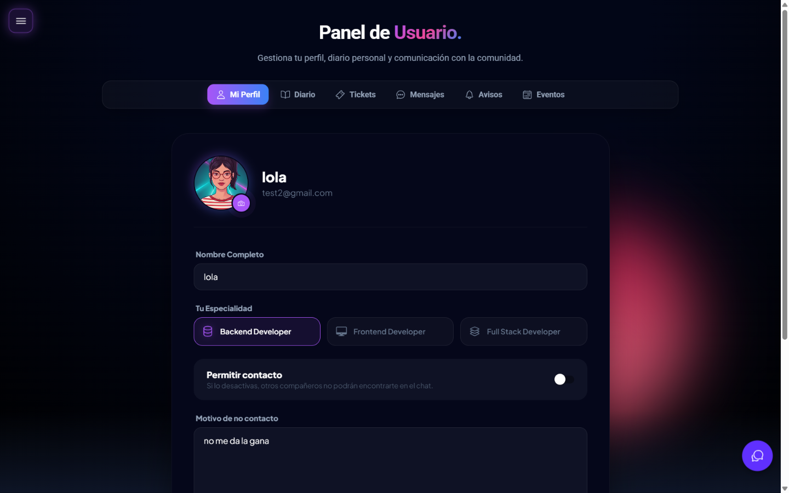

# 🚀 Guía de Presentación DevNexus (Slidev + Motion Canvas)

Esta guía contiene todos los comandos y pasos necesarios para gestionar la presentación de tu TFG con un acabado profesional de nivel Senior.

---

## 📽️ 1. Slidev (Diapositivas Interactivas)

Slidev transforma tu archivo `slides.md` en una aplicación web interactiva.

### 🛠️ Comandos Principales
- **Arrancar en modo desarrollo:**
  ```powershell
  npx @slidev/cli slides.md
  ```
  *(Se abrirá en `http://localhost:3030`. Los cambios que hagas en el MD se verán al instante).*

- **Generar la web final (Build):**
  ```powershell
  npx slidev build slides.md
  ```
  *(Crea una carpeta `dist/` lista para subir a internet o abrir en cualquier navegador).*

- **Exportar a PDF:**
  ```powershell
  npx slidev export slides.md
  ```

### ⌨️ Atajos de Teclado (En el navegador)
- **Espacio / Flecha Derecha:** Siguiente paso/diapositiva.
- **Flecha Izquierda:** Diapositiva anterior.
- **Tecla `O`:** Vista de pájaro (Overview).
- **Tecla `D`:** Alternar Modo Oscuro/Claro.
- **Tecla `C`:** Activar modo dibujo (para señalar cosas en vivo).
- **URL `/presenter`:** Modo presentador (notas de orador y cronómetro).

---

## 🎬 2. Motion Canvas (Animaciones Programadas)

Usa Motion Canvas para animar flujos complejos (JWT, Arquitectura, Base de Datos).

### 🛠️ Pasos para empezar
1. **Crear proyecto nuevo:**
   ```powershell
   npm init @motion-canvas@latest animaciones-tfg
   ```
2. **Copiar la escena:** Pega el código de la escena (`authFlow.tsx`) en `src/scenes/`.
3. **Ver la animación:** Corre `npm start` en la carpeta de la animación.
4. **Renderizar:** Pulsa el botón "Render" en la interfaz web para generar el video.
5. **Integrar:** Mueve el video resultante a tu carpeta de assets de Slidev y úsalo así:
   ```html
   <video src="./assets/auth-flow.mp4" autoplay loop muted />
   ```

---

## 🎨 3. Personalización del `slides.md`

### 🖼️ Cómo añadir imágenes
Guarda tus capturas en `documentación/screenshots/` y añádelas así:
```markdown

```

### 📝 Notas de Orador
Para añadir lo que vas a decir en voz alta sin que el tribunal lo vea:
```markdown
---
layout: default
---
# Título de la diapositiva
Contenido visible...

---
Esto es una nota de orador. Solo aparecerá en el Presenter Mode (localhost:3030/presenter).
```

### 📊 Diagramas Mermaid
Puedes editar los diagramas directamente en el Markdown. Si cambias el código, el dibujo se actualiza solo.

---

## 💡 Consejos de Senior para el TFG
1. **No leas las diapositivas:** Usa las diapositivas como apoyo visual. Lo importante es lo que vos explicás.
2. **Demo en vivo vs Video:** Si el WiFi del instituto es malo, llevá un video de la demo grabado por si acaso.
3. **Código Limpio:** Muestra solo los snippets de código más importantes (como los que ya pusimos en `slides.md`). No satures al tribunal con 200 líneas de código.

¡Mucho éxito con la defensa, Jesús! ¡Va a ser una **locura cósmica**! 🚀🔥
