# DOCUMENTACIÓN DEL TRABAJO DE FIN DE GRADO
## Ciclo Superior de Desarrollo de Aplicaciones Multiplataforma (DAM)

---

# 1. PORTADA

**Nombre del proyecto:** DevNexus — Plataforma Colaborativa de Gestión de Diarios, Incidencias y Comunicación para Desarrolladores

**Autor:** Jesús Alfonso Pedreño Domínguez

**Tutor/a:** [NOMBRE DEL TUTOR]

**Centro educativo:** IES Rafael Alberti

**Ciclo formativo:**  Desarrollo de Aplicaciones Multiplataforma (2º DAM)

**Curso académico:** 2025–2026

**Fecha de entrega:** Junio 2026

---

# 2. ÍNDICE DEL DOCUMENTO

1. Portada
2. Índice del documento
3. Introducción
   - 3.1 Justificación del proyecto
   - 3.2 Análisis comparativo de aplicaciones similares
   - 3.3 Tendencias del mercado
   - 3.4 Beneficios y expectativas del proyecto
4. Descripción del proyecto
   - 4.1 Tipo de proyecto
   - 4.2 Características principales
   - 4.3 Usuarios destinatarios
5. Objetivos del proyecto
   - 5.1 Objetivo general
   - 5.2 Objetivos específicos
6. Alcance del proyecto
   - 6.1 Qué incluye el proyecto
   - 6.2 Límites y restricciones
7. Requisitos del proyecto
   - 7.1 Requisitos funcionales
   - 7.2 Requisitos técnicos
   - 7.3 Requisitos legales y normativos
8. Planificación del proyecto
   - 8.1 Estructura de tareas (WBS)
   - 8.2 Cronograma (Diagrama de Gantt)
   - 8.3 Recursos necesarios
9. Plan de gestión de riesgos
   - 9.1 Identificación y evaluación de riesgos
   - 9.2 Recursos preventivos
   - 9.3 Plan de mitigación
10. Diseño
    - 10.1 Prototipado y wireframes
    - 10.2 Especificaciones técnicas
    - 10.3 Diagramas UML
11. Instalación y preparación
    - 11.1 Procedimientos para poner en marcha el proyecto
    - 11.2 Control de versiones
    - 11.3 Registro de incidencias
12. Documentación de ejecución y plan de calidad
    - 12.1 Procedimientos operativos
    - 12.2 Registro de pruebas
    - 12.3 Indicadores de calidad
    - 12.4 Métodos de verificación
13. Distribución
    - 13.1 Tecnología de distribución
    - 13.2 Descripción del proceso de distribución
14. Manuales
    - 14.1 Manual de instalación
    - 14.2 Manual de usuario
15. Conclusiones
    - 15.1 Informe final
    - 15.2 Resultados obtenidos
    - 15.3 Viabilidad del proyecto
    - 15.4 Mejoras futuras
16. Anexos
    - Anexo A: Diagrama Entidad–Relación completo
    - Anexo B: Descripción detallada de la API REST
    - Anexo C: Casos de prueba detallados
17. Índice de tablas e imágenes
18. Bibliografía y referencias

---

# 3. INTRODUCCIÓN

## 3.1 Justificación del proyecto

El presente proyecto surge de la observación de una necesidad real en entornos de desarrollo de software y equipos técnicos: la dispersión de herramientas para gestionar la comunicación interna, el seguimiento de incidencias y la documentación del trabajo diario. En muchos contextos profesionales, estas funciones se gestionan de forma independiente mediante aplicaciones distintas (correo electrónico, hojas de cálculo, gestores de tareas, aplicaciones de mensajería), lo que provoca ineficiencias, falta de trazabilidad y pérdida de información.

La idea de desarrollar **DevNexus** nace de la voluntad de unificar en una sola plataforma las funcionalidades más demandadas en equipos de desarrollo: un sistema de diarios de progreso personales y colaborativos, un gestor de tickets de soporte técnico, un módulo de mensajería interna, un calendario de eventos y un panel de administración con auditoría completa. Todo ello orientado específicamente a la comunidad de desarrolladores.

El proyecto representa la culminación del ciclo formativo de Desarrollo de Aplicaciones Multiplataforma, aplicando de forma integrada conocimientos de programación backend, desarrollo frontend, diseño de bases de datos, arquitectura de software, seguridad y despliegue en producción. Se ha optado por tecnologías de uso profesional real (Spring Boot, Angular, Ionic, Firebase, PostgreSQL, Docker) para que el resultado sea una aplicación directamente transferible a un contexto laboral.

## 3.2 Análisis comparativo de aplicaciones similares

Antes de definir el alcance del proyecto, se realizó un análisis de aplicaciones existentes en el mercado que ofrecen funcionalidades similares a las planteadas:

| Aplicación | Funcionalidades | Limitaciones frente a DevNexus |
|---|---|---|
| **Jira** | Gestión de tickets, flujos de trabajo, sprints | No incluye diarios de progreso, mensajería ni calendario personal |
| **Slack** | Mensajería en tiempo real, canales temáticos | No tiene gestión de tickets ni diarios con revisión por mentores |
| **Notion** | Notas, bases de datos, wiki colaborativo | Sin sistema de tickets ni auditoría por roles diferenciados |
| **Trello** | Gestión visual de tareas con tableros Kanban | Sin mensajería, sin diarios, sin control de acceso por roles |
| **Microsoft Teams** | Comunicación, integración con Office 365 | Alta complejidad, requiere infraestructura Microsoft, coste elevado |
| **Google Workspace** | Documentos, correo, calendario compartido | Sin sistema de tickets ni auditoría de acciones del sistema |
| **Dev.to** | Blog para desarrolladores, comunidad | Sin tickets, sin mensajería privada, sin gestión de equipos |

**Conclusión del análisis:** Ninguna de las aplicaciones analizadas combina en una única plataforma accesible y ligera las cinco funcionalidades centrales del proyecto: diarios con control de visibilidad y colaboración entre desarrolladores, tickets de soporte con historial completo, mensajería entre usuarios, eventos con calendario integrado y auditoría de acciones con control por roles. DevNexus cubre este nicho con una arquitectura moderna, abierta y orientada específicamente a la comunidad de desarrollo de software.

## 3.3 Tendencias del mercado

El desarrollo de este proyecto se enmarca dentro de varias tendencias tecnológicas actuales:

- **Arquitecturas desacopladas (API-first):** Las aplicaciones modernas separan backend y frontend, permitiendo que distintos clientes consuman la misma API REST. Esta arquitectura facilita la escalabilidad y el mantenimiento, y es la que se ha adoptado en este proyecto.

- **Aplicaciones Progressive Web App (PWA) y móvil-first:** La combinación de Angular e Ionic permite generar aplicaciones web con experiencia similar a una app nativa, adaptable a dispositivos móviles y de escritorio desde una única base de código.

- **Autenticación federada:** El uso de Firebase Authentication con Google Sign-In representa la tendencia hacia sistemas de identidad externos (SSO), más seguros y con menor fricción para el usuario.

- **Contenedorización y DevOps:** El despliegue mediante Docker y Docker Compose es ya un estándar en la industria, permitiendo reproducir entornos de forma fiable y desplegar aplicaciones de manera ágil.

- **Auditoría y trazabilidad:** La creciente importancia del cumplimiento normativo (RGPD, ISO 27001) ha impulsado la inclusión de sistemas de auditoría en las aplicaciones empresariales, algo que DevNexus implementa de forma nativa.

- **Bases de datos relacionales en la nube:** El uso de PostgreSQL gestionado (servicio en VPS) refleja la tendencia hacia bases de datos serverless y gestionadas, que eliminan la carga operativa del administrador.

- **Developer Experience (DX):** La comunidad tecnológica demanda cada vez más herramientas que mejoren la experiencia del desarrollador, integrando documentación de progreso, mentoría y colaboración en un solo lugar.

## 3.4 Beneficios y expectativas del proyecto

Los principales beneficios esperados del proyecto son:

- **Centralización de herramientas:** Un único punto de acceso para diarios de progreso, tickets de soporte, mensajes, eventos y notificaciones, reduciendo la fragmentación y mejorando la productividad del equipo.

- **Trazabilidad completa:** El sistema de auditoría registra todas las acciones relevantes, permitiendo conocer quién hizo qué y cuándo, lo que resulta esencial para la resolución de incidencias y la rendición de cuentas.

- **Control de privacidad:** Los usuarios pueden gestionar sus propios datos y definir la visibilidad de su contenido (privado, pendiente de revisión, público), respetando el derecho a la privacidad.

- **Escalabilidad técnica:** La arquitectura elegida permite ampliar funcionalidades sin rediseñar el sistema, adaptándose a crecimientos futuros tanto en usuarios como en módulos.

- **Aprendizaje aplicado:** El proyecto permite aplicar en un contexto realista tecnologías del nivel de un desarrollador junior-medio en la industria, superando el nivel mínimo esperado en un TFG de DAM.

- **Demostración de competencias:** La implementación completa (backend + frontend + despliegue Docker + base de datos + autenticación + notificaciones push) demuestra la madurez técnica del desarrollador para enfrentarse a proyectos reales.

---

# 4. DESCRIPCIÓN DEL PROYECTO

## 4.1 Tipo de proyecto

DevNexus es una **aplicación web full-stack** de tipo plataforma colaborativa, orientada a la gestión de comunidades de desarrolladores y equipos técnicos. Se trata de un proyecto de desarrollo original que integra:

- Un **backend** basado en API REST (Spring Boot + Kotlin)
- Un **frontend** web/móvil (Angular + Ionic + Capacitor)
- Una **base de datos relacional** (PostgreSQL)
- Un sistema de **autenticación externa** (Firebase Authentication)
- Un sistema de **notificaciones push** (Firebase Cloud Messaging)
- Un entorno de **despliegue containerizado** (Docker + Docker Compose)

La tipología del proyecto es **software de gestión** con componentes de comunicación, contenido y administración. No es un producto comercial, sino un prototipo funcional de nivel profesional desarrollado como Trabajo de Fin de Grado.

## 4.2 Características principales

Las características principales de la aplicación son:

**Sistema de diarios de progreso:**
- Creación de entradas de diario personal con contenido en texto enriquecido (Markdown)
- Control de visibilidad: privado, pendiente de revisión por staff, público
- Organización por temas/repositorios con posibilidad de colaboración
- Sistema de invitaciones para colaborar en temas compartidos
- Comentarios en diarios públicos
- Panel de revisión para el personal de staff (mentoría)
- Gráfico de actividad tipo GitHub (contribuciones)

**Sistema de tickets de soporte:**
- Creación de tickets con título, descripción, prioridad (alta, media, baja) y estado (abierto, en progreso, resuelto)
- Comentarios dentro de cada ticket para la comunicación entre usuario y staff
- Historial completo de cambios de estado para auditoría
- Panel de administración de tickets con filtros y búsqueda
- Chat integrado por ticket para comunicación directa

**Mensajería interna:**
- Conversaciones individuales y grupales entre usuarios
- Envío y recepción de mensajes mediante API REST con control de lectura (leído/no leído)
- Gestión de participantes: añadir y eliminar
- Filtrado de contactos por departamento (Backend Developer, Frontend Developer, Full Stack Developer)
- Bandeja de entrada para el staff (soporte chat en vivo por ticket)

**Gestión de eventos:**
- Creación de eventos con fecha, hora, título y descripción
- Visibilidad privada o pública
- Vista de calendario integrada (Syncfusion Schedule) con vistas de día, semana, mes y agenda
- Panel lateral de próximos eventos

**Sistema de notificaciones:**
- Notificaciones push mediante Firebase Cloud Messaging (FCM)
- Centro de notificaciones en la aplicación
- Marcado individual y masivo de notificaciones como leídas

**Panel de administración:**
- Gestión completa de usuarios: ver, editar, eliminar, cambiar rol
- Gestión de departamentos y estructura organizativa
- Revisión y aprobación de diarios públicos (mentoría)
- Supervisión de tickets con gestión de estados y prioridades
- Gestión de eventos globales
- Mensajería de soporte técnico (chat en vivo con usuarios)
- Registro de auditoría con niveles de severidad (INFO, WARNING, DANGER)

**Páginas públicas:**
- Landing page con animaciones y vídeo de fondo
- Página "Sobre la comunidad" con misión y visión
- Página de contacto con formulario
- Blog de noticias con diarios públicos de la comunidad
- Sección FAQ / Ayuda con preguntas frecuentes
- Política de privacidad

**Funcionalidades transversales:**
- Autenticación mediante Google (Firebase OAuth 2.0)
- Control de acceso basado en roles (ADMIN, STAFF, USER)
- Perfil de usuario personalizable (nombre, especialidad, foto)
- Control de privacidad de contacto
- Menú lateral responsive con navegación contextual
- Chat flotante de soporte técnico accesible desde cualquier página

## 4.3 Usuarios destinatarios

La aplicación está diseñada para tres perfiles de usuario:

**Usuario estándar (rol USER):**
Desarrolladores que utilizan la plataforma para documentar su progreso diario, comunicarse con otros miembros de la comunidad y solicitar soporte a través del sistema de tickets. Puede ser un estudiante, desarrollador junior o miembro de un equipo técnico.

**Personal de soporte / Mentor (rol STAFF):**
Desarrolladores senior o mentores responsables de atender las solicitudes de los usuarios, revisar el contenido publicado (diarios) y gestionar las comunicaciones de soporte. Dispone de permisos adicionales para moderar contenido y actualizar el estado de tickets.

**Administrador (rol ADMIN):**
Persona responsable de la gestión global de la plataforma: usuarios, departamentos, configuración general y supervisión de todas las actividades mediante el panel de auditoría. Tiene acceso completo a todas las funcionalidades del sistema.

*Figura 1: Diagrama de roles y permisos del sistema*

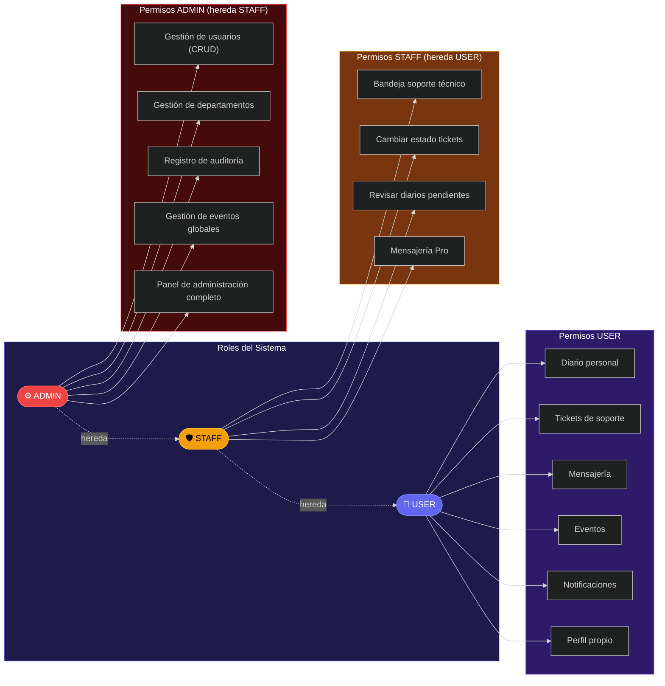
```mermaid
%%{init: {'theme': 'dark'}}%%
graph LR
    subgraph Roles["Roles del Sistema"]
        USER(["👤 USER"])
        STAFF(["🛡️ STAFF"])
        ADMIN(["⚙️ ADMIN"])
    end

    subgraph Permisos_USER["Permisos USER"]
        P1["Diario personal"]
        P2["Tickets de soporte"]
        P3["Mensajería"]
        P4["Eventos"]
        P5["Notificaciones"]
        P6["Perfil propio"]
    end

    subgraph Permisos_STAFF["Permisos STAFF (hereda USER)"]
        P7["Bandeja soporte técnico"]
        P8["Cambiar estado tickets"]
        P9["Revisar diarios pendientes"]
        P10["Mensajería Pro"]
    end

    subgraph Permisos_ADMIN["Permisos ADMIN (hereda STAFF)"]
        P11["Gestión de usuarios (CRUD)"]
        P12["Gestión de departamentos"]
        P13["Registro de auditoría"]
        P14["Gestión de eventos globales"]
        P15["Panel de administración completo"]
    end

    USER --> P1 & P2 & P3 & P4 & P5 & P6
    STAFF --> P7 & P8 & P9 & P10
    ADMIN --> P11 & P12 & P13 & P14 & P15
    STAFF -.->|"hereda"| USER
    ADMIN -.->|"hereda"| STAFF

    style USER fill:#6366f1,stroke:#818cf8,color:#fff
    style STAFF fill:#f59e0b,stroke:#fbbf24,color:#000
    style ADMIN fill:#ef4444,stroke:#f87171,color:#fff
    style Roles fill:#1e1b4b,stroke:#6366f1,color:#fff
    style Permisos_USER fill:#2d1b69,stroke:#8b5cf6,color:#fff
    style Permisos_STAFF fill:#78350f,stroke:#f59e0b,color:#fff
    style Permisos_ADMIN fill:#450a0a,stroke:#ef4444,color:#fff
```

---

# 5. OBJETIVOS DEL PROYECTO

## 5.1 Objetivo general

Diseñar, implementar y desplegar una plataforma web colaborativa completa orientada a la comunidad de desarrolladores, que integre en un único sistema la gestión de diarios de progreso, tickets de soporte, mensajería interna, eventos y auditoría, aplicando arquitecturas modernas y buenas prácticas de desarrollo de software profesional.

## 5.2 Objetivos específicos

1. **Diseñar la arquitectura del sistema** separando claramente frontend y backend mediante una API REST, siguiendo el patrón cliente-servidor desacoplado.

2. **Implementar el backend** con Spring Boot y Kotlin, organizando el código en capas (controladores, servicios, repositorios, DTOs) y documentando la API con OpenAPI/Swagger.

3. **Diseñar y normalizar la base de datos relacional** con PostgreSQL, aplicando las formas normales hasta 3FN y garantizando la integridad referencial mediante claves foráneas.

4. **Implementar el frontend** con Angular e Ionic, desarrollando una interfaz responsiva y adaptada a dispositivos móviles y de escritorio, con un diseño visual profesional.

5. **Integrar un sistema de autenticación seguro** mediante Firebase Authentication con Google Sign-In y tokens JWT para proteger los endpoints del backend.

6. **Implementar control de acceso basado en roles** (ADMIN, STAFF, USER) que limite las funcionalidades disponibles para cada perfil.

7. **Desarrollar el módulo de diarios** con control de visibilidad, sistema de revisión/mentoría y colaboración entre usuarios.

8. **Desarrollar el módulo de tickets** con gestión de estados, prioridades, comentarios, historial de cambios y chat integrado.

9. **Desarrollar el módulo de mensajería** con soporte para conversaciones individuales y grupales, filtrado por departamento.

10. **Desarrollar el módulo de eventos** con calendario Syncfusion integrado y control de visibilidad.

11. **Implementar un sistema de auditoría** que registre las acciones relevantes realizadas en el sistema, incluyendo actor, acción, recurso y severidad.

12. **Implementar notificaciones push** mediante Firebase Cloud Messaging para alertar a los usuarios de eventos relevantes en tiempo real.

13. **Desplegar el sistema completo** mediante Docker y Docker Compose, garantizando la reproducibilidad del entorno en producción.

14. **Realizar pruebas funcionales y de seguridad** que validen el correcto funcionamiento del sistema antes de su puesta en producción.

---

# 6. ALCANCE DEL PROYECTO

## 6.1 Qué incluye el proyecto

El alcance del proyecto comprende el desarrollo e implantación de los siguientes elementos:

**Backend (API REST):**
- 15 controladores REST con sus respectivos endpoints (usuarios, roles, departamentos, diarios, temas de diario, colaboraciones, tickets, comentarios de tickets, historial de tickets, conversaciones, participantes, mensajes, eventos, notificaciones, auditoría)
- 13 servicios de negocio con lógica de autorización
- 16 entidades JPA mapeadas a tablas de base de datos
- Sistema de autenticación y autorización mediante Firebase JWT + Spring Security
- Documentación automática con SpringDoc OpenAPI (Swagger UI)
- Sistema de auditoría mediante Spring AOP (aspecto transversal)
- Gestión de migraciones con Flyway
- Validación de datos de entrada con Bean Validation

**Base de datos:**
- Diseño e implementación del esquema relacional completo con 16 tablas
- Índices en campos de búsqueda frecuente
- Integridad referencial con claves foráneas
- Gestión mediante PostgreSQL (servicio Neon en la nube)
- Migraciones versionadas con Flyway

**Frontend:**
- Aplicación Angular 20 / Ionic 8 con componentes standalone
- Enrutamiento protegido por guards de autenticación y rol
- Páginas públicas: inicio (landing), sobre la comunidad, blog, FAQ, contacto, privacidad
- Sección de usuario: perfil, diario de progreso, tickets, mensajes, notificaciones, eventos
- Panel de administración completo: gestión de usuarios, tickets, diarios, eventos, mensajes de soporte, auditoría, departamentos, perfil
- Interceptor HTTP para gestión automática de tokens de autenticación
- Integración con Firebase (autenticación, FCM para notificaciones push)
- Calendario Syncfusion EJ2 Schedule con múltiples vistas
- ChangeDetectionStrategy.OnPush en todos los componentes (optimización de rendimiento)
- Diseño visual profesional con tema oscuro y gradientes

**Despliegue:**
- Dockerfile multi-stage para backend (Maven build + JRE runtime)
- Dockerfile multi-stage para frontend (Node build + Nginx)
- Docker Compose para orquestación de todos los servicios
- Configuración de Nginx para SPA routing

**Documentación:**
- Documentación técnica completa del proyecto
- Manual de instalación y uso
- Diagramas UML (casos de uso, secuencia, E-R, componentes, despliegue)

## 6.2 Límites y restricciones

**Fuera del alcance:**
- Desarrollo de aplicaciones móviles nativas distribuidas en tiendas (iOS/Android). El frontend Ionic genera una PWA y aplicación Capacitor, pero no se publica en App Store ni Google Play.
- Integración con sistemas ERP, CRM u otros sistemas empresariales externos.
- Panel de analítica avanzada o business intelligence.
- Sistema de facturación o pagos.
- Soporte para múltiples idiomas (i18n). La aplicación está íntegramente en español.
- Pipeline CI/CD automatizado (GitHub Actions, Jenkins, etc.).

**Restricciones técnicas:**
- La autenticación requiere cuenta Google (no hay registro con email/contraseña propio). El restablecimiento de contraseña es gestionado íntegramente por Firebase.
- El sistema de mensajería utiliza API REST con actualización bajo demanda (no WebSockets). Las notificaciones de nuevos mensajes se gestionan mediante Firebase Cloud Messaging (FCM).
- El almacenamiento de archivos adjuntos no está implementado en la versión actual.

**Restricciones de recursos:**
- Desarrollo realizado por un único desarrollador durante el período del TFG.
- Infraestructura limitada al plan gratuito del servicio de base de datos en la nube (Neon).

---

# 7. REQUISITOS DEL PROYECTO

## 7.1 Requisitos funcionales

Los requisitos funcionales describen el comportamiento del sistema desde el punto de vista del usuario.

### Gestión de usuarios

| ID | Requisito |
|---|---|
| RF-01 | El sistema debe permitir que los usuarios se registren mediante su cuenta de Google (Firebase Authentication). |
| RF-02 | El sistema debe asignar automáticamente el rol USER a los nuevos registros, salvo asignación manual por parte de un administrador. |
| RF-03 | El usuario debe poder consultar y modificar su perfil (nombre, especialidad técnica, foto de perfil). |
| RF-04 | El usuario debe poder configurar sus preferencias de contacto (permitir/no permitir que otros usuarios le contacten, con motivo opcional). |
| RF-05 | Los administradores deben poder gestionar usuarios: ver, editar rol/departamento y eliminar. |
| RF-06 | El sistema debe permitir organizar usuarios por departamentos (Backend Developer, Frontend Developer, Full Stack Developer). |

### Sistema de diarios

| ID | Requisito |
|---|---|
| RF-07 | El usuario debe poder crear entradas de diario asociadas a un tema/repositorio. |
| RF-08 | El usuario debe poder definir la visibilidad de cada entrada: privada, pendiente de revisión o pública. |
| RF-09 | El sistema debe permitir crear temas de diario e invitar a otros usuarios a colaborar en ellos. |
| RF-10 | Los usuarios invitados deben poder aceptar o rechazar invitaciones de colaboración. |
| RF-11 | El personal de staff debe poder revisar y aprobar o rechazar las entradas marcadas como "pendiente". |
| RF-12 | Los usuarios deben poder comentar en los diarios públicos. |

### Sistema de tickets

| ID | Requisito |
|---|---|
| RF-13 | El usuario debe poder crear tickets de soporte con título, descripción y prioridad. |
| RF-14 | El sistema debe mostrar al usuario sus propios tickets con su estado actual, con filtros por estado (activos, historial, todos). |
| RF-15 | El personal autorizado (STAFF/ADMIN) debe poder cambiar el estado de un ticket (ABIERTO → EN_PROGRESO → RESUELTO). |
| RF-16 | El sistema debe registrar el historial completo de cambios de estado de cada ticket. |
| RF-17 | Los usuarios deben poder comunicarse con el staff a través del chat integrado en cada ticket. |

### Mensajería

| ID | Requisito |
|---|---|
| RF-18 | El sistema debe permitir crear conversaciones individuales o grupales. |
| RF-19 | Los participantes de una conversación deben poder enviar y recibir mensajes. |
| RF-20 | El sistema debe registrar el estado de lectura de los mensajes. |
| RF-21 | Los usuarios deben poder filtrar contactos por departamento al crear una conversación. |
| RF-22 | Los administradores deben poder gestionar una bandeja de soporte para atender a los usuarios. |

### Eventos

| ID | Requisito |
|---|---|
| RF-23 | El usuario debe poder crear eventos con fecha, hora, título, descripción y visibilidad (público/privado). |
| RF-24 | El sistema debe mostrar los eventos en una vista de calendario con opciones de día, semana, mes y agenda. |
| RF-25 | El usuario debe poder eliminar sus propios eventos. |

### Notificaciones

| ID | Requisito |
|---|---|
| RF-26 | El sistema debe enviar notificaciones push cuando se produzcan eventos relevantes (nuevo mensaje, respuesta a ticket, etc.). |
| RF-27 | El usuario debe poder consultar y marcar como leídas sus notificaciones (individual y masivamente). |

### Auditoría

| ID | Requisito |
|---|---|
| RF-28 | El sistema debe registrar automáticamente las acciones relevantes (login, creación, modificación, eliminación de recursos). |
| RF-29 | Los administradores deben poder consultar el registro de auditoría con búsqueda y filtros por nivel de severidad. |

## 7.2 Requisitos técnicos

### Backend

| ID | Requisito |
|---|---|
| RT-01 | El backend debe estar desarrollado con **Spring Boot 3.x** y **Kotlin**. |
| RT-02 | El backend debe exponer una **API REST** que cumpla con los principios RESTful. |
| RT-03 | La API debe estar documentada automáticamente con **SpringDoc OpenAPI 3.0** (Swagger UI). |
| RT-04 | La autenticación debe basarse en **tokens JWT** generados por Firebase Authentication. |
| RT-05 | El sistema debe implementar autorización por roles mediante **Spring Security** y anotaciones `@PreAuthorize`. |
| RT-06 | La arquitectura del backend debe seguir el patrón de capas: Controller → Service → Repository → Entity/DTO. |
| RT-07 | El sistema de auditoría debe implementarse mediante **Spring AOP** con aspecto transversal. |
| RT-08 | Las notificaciones push deben enviarse mediante **Firebase Cloud Messaging (FCM)**. |
| RT-09 | La gestión del esquema de base de datos debe realizarse con **Flyway** (migraciones versionadas). |

### Base de datos

| ID | Requisito |
|---|---|
| RT-10 | La base de datos debe ser **PostgreSQL** (versión 14 o superior). |
| RT-11 | El esquema debe diseñarse aplicando normalización hasta la **Tercera Forma Normal (3FN)**. |
| RT-12 | Deben definirse **índices** sobre los campos utilizados frecuentemente en consultas y filtros. |

### Frontend

| ID | Requisito |
|---|---|
| RT-13 | El frontend debe estar desarrollado con **Angular 20** e **Ionic 8** (componentes standalone). |
| RT-14 | La aplicación debe ser **responsiva** y adaptarse a pantallas de móvil, tablet y escritorio. |
| RT-15 | La navegación debe estar protegida mediante **guards de Angular** que comprueben autenticación y rol. |
| RT-16 | Las peticiones HTTP al backend deben incluir automáticamente el token JWT mediante un **interceptor Angular**. |
| RT-17 | La integración de calendario debe realizarse con **Syncfusion EJ2 Schedule**. |
| RT-18 | Todos los componentes deben usar **ChangeDetectionStrategy.OnPush** para optimizar el rendimiento. |

### Despliegue

| ID | Requisito |
|---|---|
| RT-19 | Todos los componentes deben poder desplegarse mediante **Docker** y **Docker Compose**. |
| RT-20 | El frontend debe compilarse para producción y servirse mediante **Nginx**. |
| RT-21 | La configuración sensible debe gestionarse mediante **variables de entorno**, sin incluirla en el código fuente. |

### Rendimiento y seguridad

| ID | Requisito |
|---|---|
| RT-22 | Las peticiones protegidas deben devolver **HTTP 401** sin token válido y **HTTP 403** sin permisos suficientes. |
| RT-23 | Todos los datos de entrada deben ser **validados** en el backend antes de procesarse. |

## 7.3 Requisitos legales y normativos

### Protección de datos (RGPD)

| ID | Requisito |
|---|---|
| RL-01 | La aplicación debe informar a los usuarios sobre el tratamiento de sus datos personales mediante una política de privacidad accesible desde la interfaz. |
| RL-02 | Los datos personales de los usuarios (nombre, email, foto de perfil) provienen de la cuenta de Google mediante OAuth 2.0, y su tratamiento está sujeto a las condiciones de Google y al RGPD. |
| RL-03 | Los usuarios deben poder eliminar su propia cuenta y datos desde la aplicación (derecho de supresión — RGPD Art. 17). El endpoint `DELETE /api/usuarios/perfil` implementa esta funcionalidad. |
| RL-04 | Los datos no deben compartirse con terceros no autorizados ni usarse con fines distintos a los declarados. |
| RL-05 | La aplicación debe implementar medidas técnicas de seguridad adecuadas (autenticación, HTTPS, control de acceso) para proteger los datos personales. |

### Licencias de software

| ID | Requisito |
|---|---|
| RL-06 | Todas las dependencias y librerías utilizadas deben usarse respetando sus licencias. Syncfusion requiere licencia de uso, registrada en el proyecto. |
| RL-07 | El software desarrollado es un proyecto académico sin fines comerciales. |

### Accesibilidad

| ID | Requisito |
|---|---|
| RL-08 | La aplicación debe seguir, en la medida de lo posible, las pautas de accesibilidad WCAG 2.1 nivel A. |

---

# 8. PLANIFICACIÓN DEL PROYECTO

## 8.1 Estructura de tareas (WBS — Work Breakdown Structure)

El proyecto se ha dividido en las siguientes fases y tareas principales:

### FASE 1: Análisis y diseño (Semanas 1–3)
- 1.1 Análisis de requisitos funcionales y no funcionales
- 1.2 Análisis comparativo de aplicaciones similares
- 1.3 Diseño del modelo de datos (entidades y relaciones)
- 1.4 Diseño de la arquitectura del sistema (API-first)
- 1.5 Diseño de los wireframes de la interfaz de usuario
- 1.6 Definición de la API (endpoints, métodos, DTOs)
- 1.7 Planificación del proyecto y gestión de riesgos

### FASE 2: Configuración del entorno (Semanas 3–4)
- 2.1 Configuración del repositorio Git y estrategia de ramas
- 2.2 Configuración del proyecto Spring Boot (Kotlin + Maven)
- 2.3 Configuración del proyecto Angular/Ionic (standalone components)
- 2.4 Configuración de Firebase (Authentication + FCM)
- 2.5 Creación y configuración de la base de datos PostgreSQL (Neon)
- 2.6 Configuración del entorno de desarrollo local

### FASE 3: Desarrollo del backend (Semanas 4–10)
- 3.1 Implementación del modelo de datos (entidades JPA)
- 3.2 Implementación de repositorios (Spring Data JPA)
- 3.3 Implementación de la seguridad (Firebase JWT + Spring Security)
- 3.4 Implementación del módulo de usuarios, roles y departamentos
- 3.5 Implementación del módulo de diarios, temas y colaboraciones
- 3.6 Implementación del módulo de tickets, comentarios e historial
- 3.7 Implementación del módulo de mensajería (conversaciones + mensajes)
- 3.8 Implementación del módulo de eventos
- 3.9 Implementación del módulo de notificaciones y FCM
- 3.10 Implementación del sistema de auditoría (Spring AOP)
- 3.11 Configuración de SpringDoc OpenAPI (Swagger UI)
- 3.12 Configuración de Flyway para migraciones
- 3.13 Pruebas de endpoints con Swagger

### FASE 4: Desarrollo del frontend (Semanas 8–14)
- 4.1 Configuración del routing, guards e interceptor HTTP
- 4.2 Desarrollo de las páginas públicas (landing, about, blog, FAQ, contacto, privacidad)
- 4.3 Desarrollo del flujo de autenticación (Google Sign-In)
- 4.4 Desarrollo de la sección de perfil de usuario
- 4.5 Desarrollo del módulo de diarios (lista, detalle, creación, temas, invitaciones, gráfico de actividad)
- 4.6 Desarrollo del módulo de tickets (lista, detalle, chat integrado)
- 4.7 Desarrollo del módulo de mensajería (conversaciones, filtro por departamento)
- 4.8 Desarrollo del módulo de eventos y calendario Syncfusion
- 4.9 Desarrollo del centro de notificaciones
- 4.10 Desarrollo del panel de administración completo (8 secciones)
- 4.11 Integración con Firebase (autenticación, FCM, service worker)
- 4.12 Diseño visual: tema oscuro, gradientes, animaciones
- 4.13 Ajustes de diseño responsivo (móvil/tablet/escritorio)
- 4.14 Optimización: OnPush en todos los componentes

### FASE 5: Integración y pruebas (Semanas 14–16)
- 5.1 Pruebas de integración frontend–backend
- 5.2 Pruebas funcionales de cada módulo
- 5.3 Pruebas de autenticación y autorización por roles
- 5.4 Pruebas de validación de datos
- 5.5 Corrección de errores detectados
- 5.6 Pruebas de usabilidad

### FASE 6: Despliegue (Semanas 16–17)
- 6.1 Creación de Dockerfile multi-stage para el backend
- 6.2 Creación de Dockerfile multi-stage para el frontend (build + Nginx)
- 6.3 Configuración de Docker Compose con health checks
- 6.4 Pruebas del despliegue local con Docker Compose
- 6.5 Despliegue en entorno de producción (VPS)
- 6.6 Configuración de dominio devnexus.es
- 6.7 Pruebas de validación en producción

### FASE 7: Documentación y entrega (Semanas 17–18)
- 7.1 Redacción de la documentación técnica completa
- 7.2 Redacción del manual de instalación y uso
- 7.3 Preparación de la defensa oral
- 7.4 Revisión final y entrega

## 8.2 Cronograma (Diagrama de Gantt)

El proyecto se planificó para un período de 18 semanas (aproximadamente 4,5 meses):

*Figura 2: Diagrama de Gantt del proyecto*

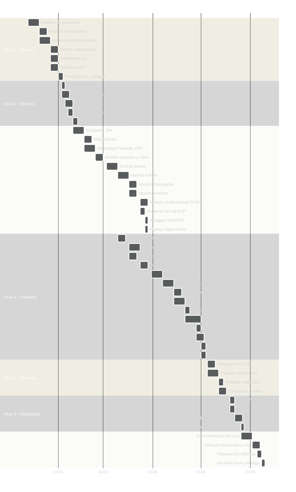
```mermaid
%%{init: {'theme': 'dark'}}%%
gantt
    title Cronograma del Proyecto DevNexus — TFG DAM
    dateFormat  YYYY-MM-DD
    axisFormat  %d/%m

    section Fase 1 - Analisis
    Analisis de requisitos           :f1a, 2025-01-13, 7d
    Analisis comparativo             :f1b, 2025-01-20, 5d
    Diseno modelo de datos           :f1c, 2025-01-20, 7d
    Diseno arquitectura              :f1d, 2025-01-27, 5d
    Wireframes UI                    :f1e, 2025-01-27, 5d
    Definicion API                   :f1f, 2025-01-27, 5d
    Planificacion y riesgos          :f1g, 2025-02-01, 3d

    section Fase 2 - Entorno
    Repositorio Git                  :f2a, 2025-02-03, 2d
    Config Spring Boot               :f2b, 2025-02-03, 5d
    Config Angular/Ionic             :f2c, 2025-02-05, 5d
    Config Firebase                  :f2d, 2025-02-07, 3d
    Config PostgreSQL Neon           :f2e, 2025-02-10, 3d

    section Fase 3 - Backend
    Entidades JPA                    :f3a, 2025-02-10, 7d
    Repositorios                     :f3b, 2025-02-17, 5d
    Seguridad Firebase JWT           :f3c, 2025-02-17, 7d
    Modulo usuarios y roles          :f3d, 2025-02-24, 5d
    Modulo diarios                   :f3e, 2025-03-03, 7d
    Modulo tickets                   :f3f, 2025-03-10, 7d
    Modulo mensajeria                :f3g, 2025-03-17, 5d
    Modulo eventos                   :f3h, 2025-03-17, 5d
    Modulo notificaciones FCM        :f3i, 2025-03-24, 5d
    Auditoria Spring AOP             :f3j, 2025-03-24, 3d
    Swagger OpenAPI                  :f3k, 2025-03-27, 2d
    Flyway migraciones               :f3l, 2025-03-27, 2d

    section Fase 4 - Frontend
    Routing guards interceptor       :f4a, 2025-03-10, 5d
    Paginas publicas                 :f4b, 2025-03-17, 7d
    Autenticacion Google             :f4c, 2025-03-17, 5d
    Perfil usuario                   :f4d, 2025-03-24, 5d
    Modulo diarios FE                :f4e, 2025-03-31, 7d
    Modulo tickets FE                :f4f, 2025-04-07, 7d
    Modulo mensajeria FE             :f4g, 2025-04-14, 5d
    Modulo eventos calendario        :f4h, 2025-04-14, 7d
    Centro notificaciones            :f4i, 2025-04-21, 3d
    Panel administracion             :f4j, 2025-04-21, 10d
    Firebase integration             :f4k, 2025-04-28, 3d
    Diseno visual tema oscuro        :f4l, 2025-04-28, 5d
    Responsive design                :f4m, 2025-05-01, 3d
    OnPush optimization              :f4n, 2025-05-01, 3d

    section Fase 5 - Pruebas
    Integracion FE-BE                :f5a, 2025-05-05, 5d
    Pruebas funcionales              :f5b, 2025-05-05, 7d
    Pruebas seguridad                :f5c, 2025-05-12, 3d
    Correccion errores               :f5d, 2025-05-12, 5d

    section Fase 6 - Despliegue
    Dockerfiles multi-stage          :f6a, 2025-05-19, 3d
    Docker Compose                   :f6b, 2025-05-19, 3d
    Despliegue produccion            :f6c, 2025-05-22, 5d
    Config dominio devnexus.es       :f6d, 2025-05-26, 2d

    section Fase 7 - Documentacion
    Documentacion tecnica            :f7a, 2025-05-26, 7d
    Manual instalacion y uso         :f7b, 2025-06-02, 5d
    Preparacion defensa              :f7c, 2025-06-05, 3d
    Revision final y entrega         :f7d, 2025-06-08, 2d
```

| Fase | Semanas | Duración |
|---|---|---|
| F1. Análisis y diseño | 1–3 | 3 semanas |
| F2. Configuración del entorno | 3–4 | 2 semanas |
| F3. Desarrollo del backend | 4–10 | 7 semanas |
| F4. Desarrollo del frontend | 8–14 | 7 semanas |
| F5. Integración y pruebas | 14–16 | 2 semanas |
| F6. Despliegue | 16–17 | 2 semanas |
| F7. Documentación y entrega | 17–18 | 2 semanas |

*Nota: Las fases de backend y frontend se solapan a partir de la semana 8, siguiendo un enfoque iterativo que permite desarrollar en paralelo ambas capas una vez establecidas las interfaces de la API.*

## 8.3 Recursos necesarios

### Recursos técnicos — Hardware

| Recurso | Especificación |
|---|---|
| Ordenador de desarrollo | Mínimo 16 GB de RAM, procesador multinúcleo |
| Conexión a Internet | Necesaria para servicios en la nube (Firebase, Neon) |

### Recursos técnicos — Software

| Herramienta | Versión | Uso |
|---|---|---|
| IntelliJ IDEA / VS Code | Última | IDE de desarrollo |
| Java JDK | 17 (LTS) | Compilación del backend |
| Kotlin | 1.9.25 | Lenguaje del backend |
| Maven | 3.9 | Gestión de dependencias backend |
| Node.js | 20 (LTS) | Entorno de ejecución frontend |
| Angular CLI | 20 | Scaffolding y build del frontend |
| Ionic CLI | 8 | Framework UI móvil |
| Capacitor | 7.4.4 | Wrapper nativo Android |
| Docker Desktop | Última | Contenedorización |
| Git + GitHub | Última | Control de versiones |
| Postman / Swagger UI | Última | Prueba de endpoints |
| pgAdmin | 4 | Gestión de base de datos |
| Firebase Console | Web | Configuración de servicios Firebase |

### Recursos técnicos — Servicios en la nube

| Servicio | Plan | Uso |
|---|---|---|
| Firebase Authentication | Gratuito (Spark) | Autenticación de usuarios con Google |
| Firebase Cloud Messaging | Gratuito | Notificaciones push |
| Neon PostgreSQL | Gratuito (tier básico) | Base de datos en la nube |
| GitHub | Gratuito | Repositorio de código |

### Recursos humanos
- 1 desarrollador (el alumno): responsable de análisis, diseño, desarrollo, pruebas y documentación
- Tutor del centro: orientación y revisión del proyecto

---

# 9. PLAN DE GESTIÓN DE RIESGOS

## 9.1 Identificación y evaluación de riesgos

Se han identificado los principales riesgos que podrían afectar al desarrollo del proyecto, evaluados según su probabilidad e impacto (escala 1–5):

| ID | Riesgo | Prob. | Impacto | Criticidad |
|---|---|---|---|---|
| R-01 | Cambios en la API de Firebase que rompan la autenticación | 2 | 5 | Alta |
| R-02 | Incompatibilidades de versiones entre Angular/Ionic y dependencias | 3 | 4 | Alta |
| R-03 | Pérdida de datos en la base de datos de desarrollo | 2 | 4 | Media-Alta |
| R-04 | Subestimación del tiempo de desarrollo de algún módulo | 4 | 3 | Alta |
| R-05 | Limitaciones del plan gratuito de Neon (tamaño, conexiones) | 3 | 3 | Media |
| R-06 | Problemas de CORS entre frontend y backend en producción | 3 | 3 | Media |
| R-07 | Errores de seguridad (acceso no autorizado a recursos) | 2 | 5 | Alta |
| R-08 | Problemas en la configuración de Docker en producción | 3 | 3 | Media |
| R-09 | Cambios de diseño tardíos que requieran refactorización | 3 | 2 | Media |
| R-10 | Ausencia de soporte técnico para una tecnología concreta | 2 | 3 | Baja-Media |

## 9.2 Recursos preventivos

- **R-01 (Firebase API):** Seguir la documentación oficial y fijar versiones de dependencias en `pom.xml` y `package.json`.
- **R-02 (Incompatibilidades):** Utilizar versiones LTS estables. Actualizar dependencias de forma controlada, probando en entorno local antes de integrar.
- **R-03 (Pérdida de datos):** Backups regulares. Scripts de inicialización (`import.sql`) para recrear datos de prueba. Migraciones Flyway versionadas.
- **R-04 (Tiempo):** Planificación con holgura entre fases. Priorizar funcionalidades core del MVP.
- **R-05 (Neon limitaciones):** Monitorizar uso de almacenamiento. Plan de migración a PostgreSQL local en Docker si fuera necesario.
- **R-06 (CORS):** Configurar correctamente la política CORS en Spring Boot desde el inicio, especificando los orígenes permitidos.
- **R-07 (Seguridad):** Pruebas específicas de autorización. Revisión sistemática de endpoints con Swagger.
- **R-08 (Docker):** Probar despliegue con Docker Compose en local antes de producción. Documentar todos los pasos.
- **R-09 (Diseño):** Validar wireframes y arquitectura antes de comenzar el desarrollo.
- **R-10 (Soporte técnico):** Consultar documentación oficial, Stack Overflow, GitHub Issues.

## 9.3 Plan de mitigación

| ID | Riesgo materializado | Plan de mitigación |
|---|---|---|
| R-01 | Firebase API cambia | Migrar a versión compatible o alternativa JWT propia |
| R-02 | Incompatibilidad de versiones | Retroceder a la versión estable anterior de la dependencia afectada |
| R-03 | Pérdida de datos | Restaurar desde último backup; recrear datos con scripts |
| R-04 | Tiempo insuficiente | Reducir alcance a funcionalidades del MVP |
| R-05 | Neon lleno | Migrar la base de datos a PostgreSQL en Docker |
| R-06 | CORS en producción | Ajustar configuración CORS para el dominio de producción |
| R-07 | Brecha de seguridad | Identificar endpoint afectado, aplicar corrección, volver a probar |
| R-08 | Docker falla | Revisar logs; consultar documentación; desplegar sin Docker si necesario |
| R-09 | Rediseño tardío | Implementar cambio de forma incremental |
| R-10 | Sin soporte técnico | Ampliar búsqueda en documentación, GitHub, Stack Overflow |

---

# 10. DISEÑO

## 10.1 Prototipado y wireframes

El diseño de la interfaz de usuario se ha planificado siguiendo un enfoque mobile-first, aprovechando las capacidades de Ionic para generar interfaces adaptadas a dispositivos móviles y de escritorio. El diseño visual utiliza un tema oscuro con gradientes en tonos púrpura y rosa, buscando una estética moderna y profesional orientada a desarrolladores.

### Páginas públicas

Las páginas públicas siguen una estructura de landing page con barra de navegación lateral, secciones de contenido y chat flotante de soporte. El acceso a la aplicación se realiza mediante el botón de inicio de sesión con Google.


*Figura 3: Landing page — sección hero*

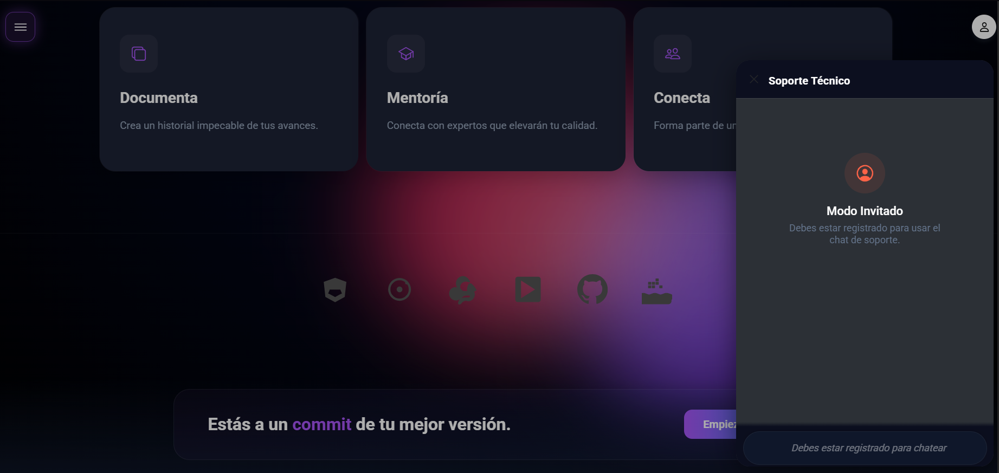

*Figura 4: Landing page — sección de características*

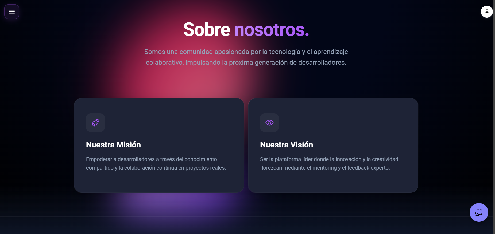

*Figura 5: Página "Sobre nosotros" — Misión y Visión*

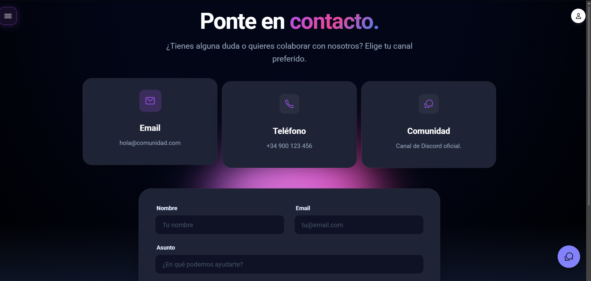

*Figura 6: Página de Contacto*

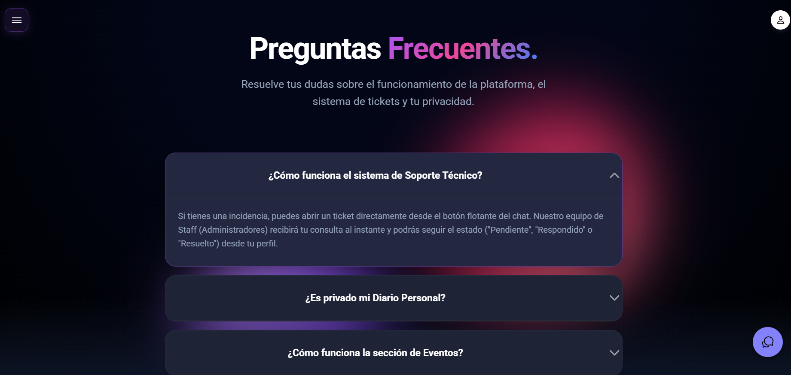

*Figura 7: Página FAQ / Preguntas Frecuentes*

### Dashboard de usuario

Una vez autenticado, el usuario accede a su panel personal ("Panel de Usuario") con las siguientes secciones accesibles desde las pestañas superiores:

- **Mi Perfil:** Datos personales, especialidad técnica y configuración de privacidad
- **Diario:** Gráfico de actividad, listado de repositorios/temas y entradas de diario
- **Tickets:** Centro de soporte con filtros (activos, historial, todos) y chat por ticket
- **Mensajes:** Conversaciones activas con filtro por departamento
- **Avisos:** Centro de notificaciones con marcado masivo
- **Eventos:** Calendario Syncfusion con vistas múltiples y panel de próximos eventos

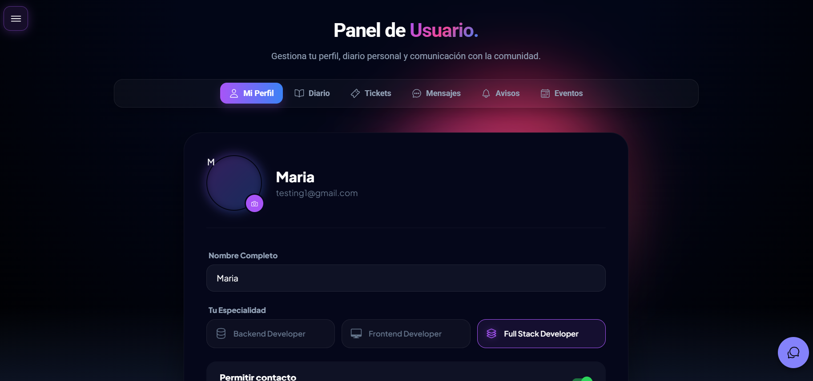

*Figura 8: Panel de Usuario — Mi Perfil*

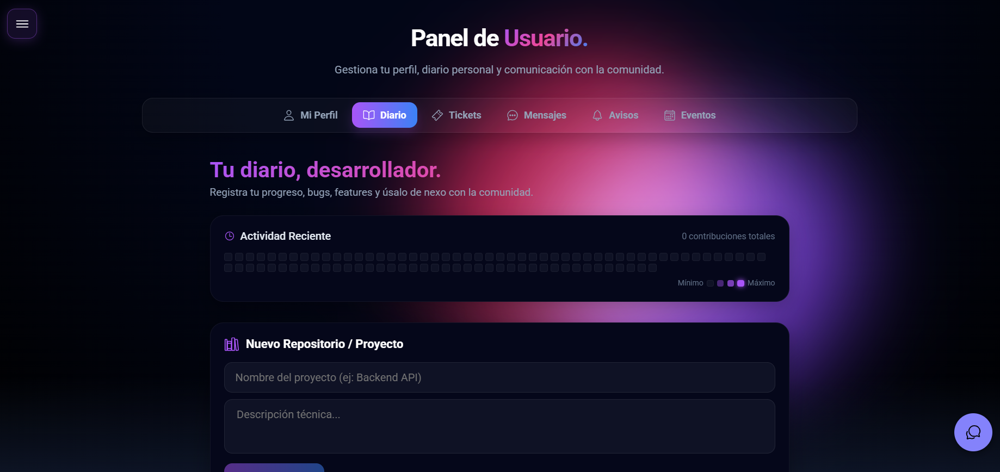

*Figura 9: Panel de Usuario — Diario de progreso*

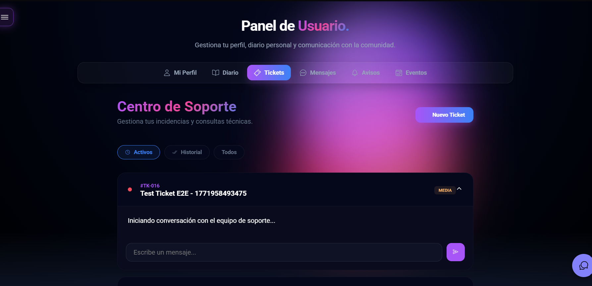

*Figura 10: Panel de Usuario — Centro de Soporte (Tickets)*

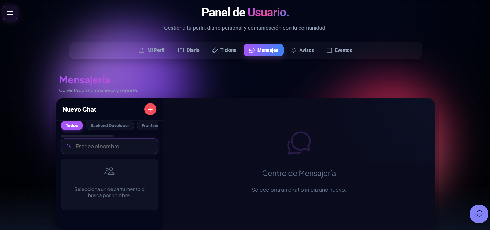

*Figura 11: Panel de Usuario — Mensajería*

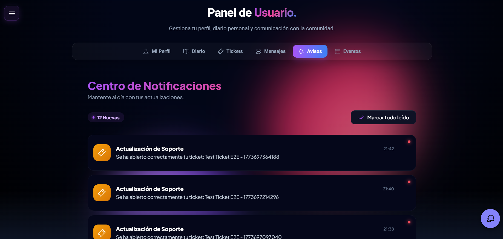

*Figura 12: Panel de Usuario — Centro de Notificaciones*


*Figura 13: Panel de Usuario — Agenda y Eventos*

### Panel de administración

El administrador y el staff acceden a un panel diferenciado ("Panel de Administración") con:

- **Usuarios:** Tabla de gestión con búsqueda, filtros, edición de rol/departamento y eliminación
- **Chats-Servicio técnico:** Tickets activos con chat en vivo con usuarios
- **Tickets:** Vista global de todos los tickets con código, prioridad, estado y chat
- **Mensajes:** Mensajería Pro para comunicación administrativa
- **Eventos:** Gestión de eventos globales con creación y filtros
- **Diarios:** Gestión de diarios por usuario para revisión y mentoría
- **Auditoría:** Registro de acciones del sistema con nivel, acción, recurso, usuario, detalles y fecha
- **Perfil:** Perfil del administrador con los mismos campos que el usuario

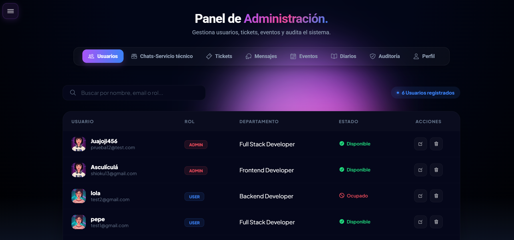

*Figura 14: Panel de Administración — Gestión de Usuarios*


*Figura 15: Panel de Administración — Editar Usuario (modal)*


*Figura 16: Panel de Administración — Chats-Servicio Técnico*


*Figura 17: Panel de Administración — Gestión de Tickets*


*Figura 18: Panel de Administración — Mensajería Pro*

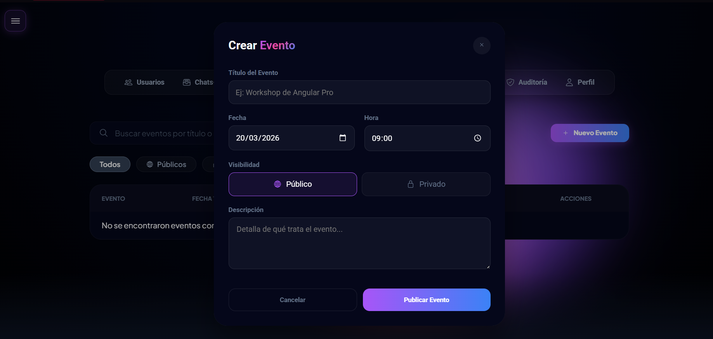

*Figura 19: Panel de Administración — Crear Evento (modal)*

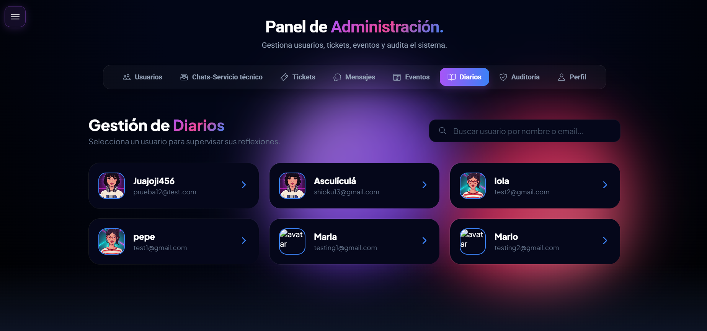

*Figura 20: Panel de Administración — Gestión de Diarios*


*Figura 21: Panel de Administración — Registro de Auditoría*


*Figura 22: Panel de Administración — Perfil del Administrador*

### Blog de la comunidad

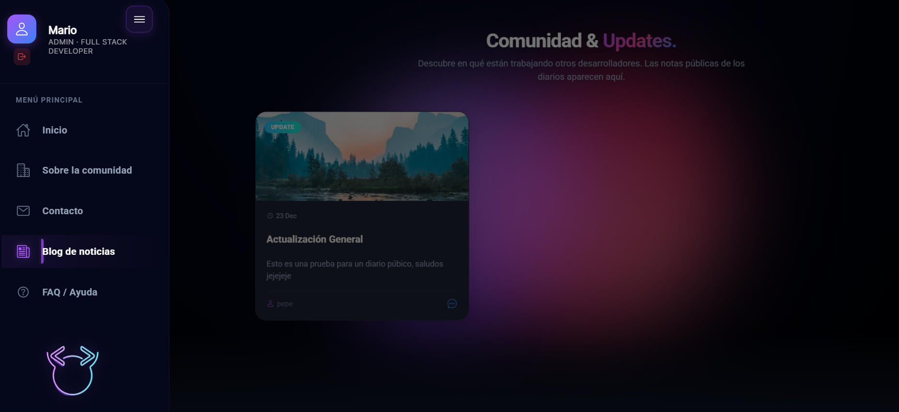

*Figura 23: Blog — Comunidad & Updates*

## 10.2 Especificaciones técnicas

### Arquitectura global del sistema

*Figura 24: Diagrama de arquitectura global del sistema*

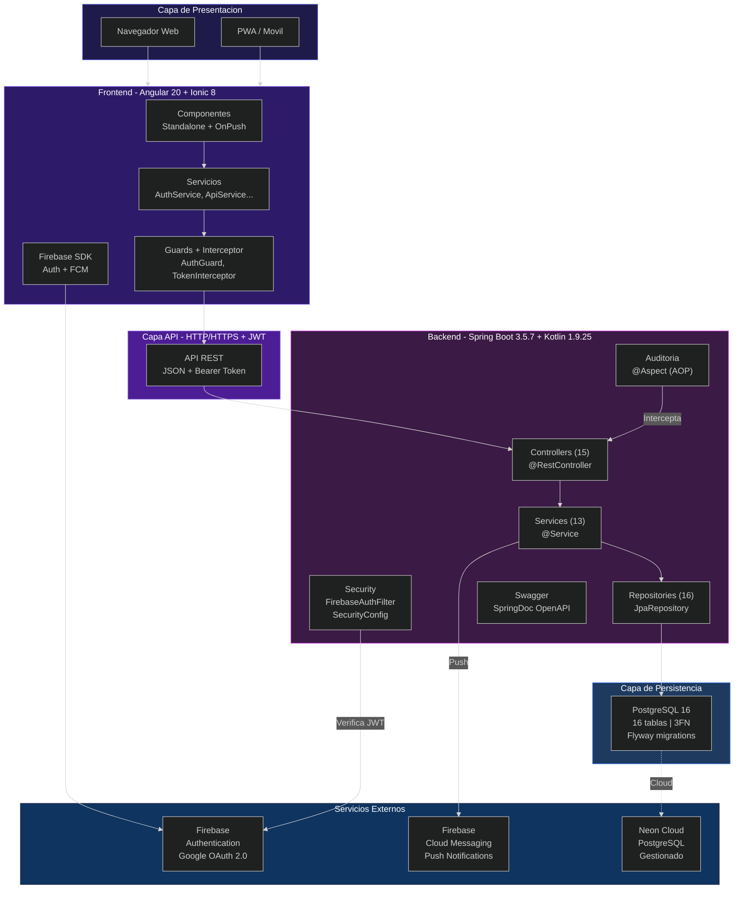
```mermaid
%%{init: {'theme': 'dark'}}%%
graph TB
    subgraph ClientLayer["Capa de Presentacion"]
        direction LR
        Browser["Navegador Web"]
        PWA["PWA / Movil"]
    end

    subgraph FrontendLayer["Frontend - Angular 20 + Ionic 8"]
        direction LR
        Components["Componentes<br/>Standalone + OnPush"]
        Services["Servicios<br/>AuthService, ApiService..."]
        GuardsInt["Guards + Interceptor<br/>AuthGuard, TokenInterceptor"]
        FirebaseFE["Firebase SDK<br/>Auth + FCM"]
    end

    subgraph APILayer["Capa API - HTTP/HTTPS + JWT"]
        API["API REST<br/>JSON + Bearer Token"]
    end

    subgraph BackendLayer["Backend - Spring Boot 3.5.7 + Kotlin 1.9.25"]
        direction LR
        Controllers["Controllers (15)<br/>@RestController"]
        ServicesBE["Services (13)<br/>@Service"]
        Repositories["Repositories (16)<br/>JpaRepository"]
        SecurityBE["Security<br/>FirebaseAuthFilter<br/>SecurityConfig"]
        AuditBE["Auditoria<br/>@Aspect (AOP)"]
        SwaggerBE["Swagger<br/>SpringDoc OpenAPI"]
    end

    subgraph DataLayer["Capa de Persistencia"]
        PostgreSQL["PostgreSQL 16<br/>16 tablas | 3FN<br/>Flyway migrations"]
    end

    subgraph ExternalLayer["Servicios Externos"]
        direction LR
        GAuth["Firebase<br/>Authentication<br/>Google OAuth 2.0"]
        GFCM["Firebase<br/>Cloud Messaging<br/>Push Notifications"]
        Neon["Neon Cloud<br/>PostgreSQL<br/>Gestionado"]
    end

    Browser --> FrontendLayer
    PWA --> FrontendLayer
    Components --> Services
    Services --> GuardsInt
    GuardsInt --> API
    FirebaseFE --> GAuth

    API --> Controllers
    Controllers --> ServicesBE
    ServicesBE --> Repositories
    Repositories --> PostgreSQL
    SecurityBE -->|"Verifica JWT"| GAuth
    ServicesBE -->|"Push"| GFCM
    AuditBE -->|"Intercepta"| Controllers
    PostgreSQL -.->|"Cloud"| Neon

    style ClientLayer fill:#1e1b4b,stroke:#6366f1,color:#fff
    style FrontendLayer fill:#2d1b69,stroke:#8b5cf6,color:#fff
    style APILayer fill:#4c1d95,stroke:#a78bfa,color:#fff
    style BackendLayer fill:#3b1a45,stroke:#d946ef,color:#fff
    style DataLayer fill:#1e3a5f,stroke:#3b82f6,color:#fff
    style ExternalLayer fill:#0f3460,stroke:#16213e,color:#fff
```

El sistema sigue una arquitectura cliente-servidor desacoplada con las siguientes capas:

| Capa | Componente | Tecnología |
|---|---|---|
| **Presentación** | Frontend SPA | Angular 20 + Ionic 8 |
| **API Gateway** | Servidor web (producción) | Nginx (reverse proxy) |
| **Lógica de negocio** | Backend API REST | Spring Boot 3.5.7 + Kotlin 1.9.25 |
| **Persistencia** | Base de datos relacional | PostgreSQL 16 (Neon) |
| **Autenticación** | Proveedor de identidad | Firebase Authentication (Google OAuth) |
| **Notificaciones** | Servicio push | Firebase Cloud Messaging (FCM) |
| **Contenedorización** | Orquestación | Docker + Docker Compose |

### Arquitectura del backend (patrón por capas)

El backend sigue estrictamente el patrón de arquitectura por capas:

```
Controller (HTTP) → Service (lógica de negocio) → Repository (acceso a datos) → Entity (modelo JPA)
     ↑                        ↑                          ↑
    DTO                  Security                    Database
 (entrada/salida)     (Firebase JWT)             (PostgreSQL)
```

**Capa Controller:** Recibe las peticiones HTTP, valida los datos de entrada (DTOs) y delega en la capa de servicio. Cada controlador está anotado con `@RestController` y expone endpoints REST documentados con SpringDoc.

**Capa Service:** Contiene la lógica de negocio. Gestiona transacciones, aplica reglas de autorización y coordina operaciones entre repositorios. Anotados con `@Service`.

**Capa Repository:** Interfaces que extienden `JpaRepository` de Spring Data. Definen consultas personalizadas mediante `@Query` o derivación de nombres de métodos.

**Capa Entity/Model:** Clases Kotlin anotadas con JPA (`@Entity`, `@Table`, `@Column`) que representan las tablas de la base de datos.

**Capa DTO:** Clases de transferencia de datos que separan la representación externa de la interna, evitando exponer directamente las entidades JPA.

**Capa Security:** Filtro de autenticación (`FirebaseAuthFilter`) que intercepta cada petición, verifica el token JWT con Firebase Admin SDK y establece el contexto de seguridad de Spring.

**Aspecto de Auditoría:** Componente transversal implementado con Spring AOP (`@Aspect`) que registra automáticamente las acciones realizadas en los controladores.

### Stack tecnológico completo

| Capa | Tecnología | Versión |
|---|---|---|
| Lenguaje backend | Kotlin | 1.9.25 |
| Framework backend | Spring Boot | 3.5.7 |
| ORM | Spring Data JPA / Hibernate | Incluido en Spring Boot |
| Migraciones DB | Flyway | 10.x |
| Base de datos | PostgreSQL | 16+ |
| Autenticación | Firebase Authentication | SDK Admin 9.x |
| Notificaciones push | Firebase Cloud Messaging | SDK 9.x |
| Documentación API | SpringDoc OpenAPI | 2.x |
| Build backend | Maven | 3.9 |
| Lenguaje frontend | TypeScript | 5.x |
| Framework frontend | Angular | 20.0.0 |
| UI Framework | Ionic | 8.0.0 |
| Mobile wrapper | Capacitor | 7.4.4 |
| Calendario | Syncfusion EJ2 Schedule | Última |
| Contenedorización | Docker + Docker Compose | Última |
| Servidor web (prod.) | Nginx | Alpine |
| Runtime frontend | Node.js | 20 LTS |
| JDK | Java | 17 LTS |

## 10.3 Diagramas UML

### Diagrama de Casos de Uso

*Figura 25: Diagrama de Casos de Uso UML*


```mermaid
%%{init: {'theme': 'dark'}}%%
graph TB
    subgraph Sistema["Sistema DevNexus"]
        direction TB
        UC1["Iniciar sesion /<br/>Registrarse con Google"]
        UC2["Gestionar perfil personal"]
        UC3["Crear / editar / eliminar<br/>entradas de diario"]
        UC4["Crear temas e<br/>invitar colaboradores"]
        UC5["Crear tickets de soporte"]
        UC6["Chat en ticket<br/>con staff"]
        UC7["Enviar / recibir mensajes"]
        UC8["Crear / ver / eliminar<br/>eventos"]
        UC9["Consultar notificaciones"]
        UC10["Revisar y aprobar<br/>diarios pendientes"]
        UC11["Cambiar estado<br/>de tickets"]
        UC12["Bandeja de<br/>soporte tecnico"]
        UC13["Gestionar usuarios<br/>CRUD + roles"]
        UC14["Gestionar departamentos"]
        UC15["Consultar registro<br/>de auditoria"]
        UC16["Gestionar eventos<br/>globales"]
    end

    USER(("Usuario<br/>USER"))
    STAFF(("Staff /<br/>Mentor<br/>STAFF"))
    ADMIN(("Administrador<br/>ADMIN"))

    USER --- UC1
    USER --- UC2
    USER --- UC3
    USER --- UC4
    USER --- UC5
    USER --- UC6
    USER --- UC7
    USER --- UC8
    USER --- UC9

    STAFF --- UC1
    STAFF --- UC2
    STAFF --- UC3
    STAFF --- UC7
    STAFF --- UC10
    STAFF --- UC11
    STAFF --- UC12

    ADMIN --- UC1
    ADMIN --- UC2
    ADMIN --- UC10
    ADMIN --- UC11
    ADMIN --- UC13
    ADMIN --- UC14
    ADMIN --- UC15
    ADMIN --- UC16

    style USER fill:#6366f1,stroke:#818cf8,color:#fff
    style STAFF fill:#f59e0b,stroke:#fbbf24,color:#000
    style ADMIN fill:#ef4444,stroke:#f87171,color:#fff
    style Sistema fill:#1e1b4b,stroke:#6366f1,color:#fff
```

**Actores del sistema:**

| Actor | Descripción |
|---|---|
| Usuario Estándar (USER) | Persona registrada que utiliza la plataforma para documentar progreso, comunicarse y solicitar soporte |
| Personal de Soporte (STAFF) | Mentor o desarrollador senior que modera contenido, atiende tickets y revisa diarios |
| Administrador (ADMIN) | Gestor global de la plataforma con acceso completo a todas las funcionalidades |

**Casos de uso por actor:**

El USUARIO puede:
- Iniciar sesión / Registrarse con Google
- Gestionar perfil personal (editar datos, especialidad, privacidad)
- Crear, editar y eliminar entradas de diario propias
- Crear temas de diario e invitar colaboradores
- Crear tickets de soporte y añadir comentarios/chat
- Enviar y recibir mensajes (individuales y grupales)
- Crear, ver y eliminar eventos propios
- Consultar y gestionar notificaciones

El STAFF puede (además de lo anterior):
- Ver todos los diarios públicos y pendientes de revisión
- Aprobar/rechazar diarios pendientes (mentoría)
- Ver y gestionar todos los tickets (cambiar estado)
- Acceder a la bandeja de soporte (chat en vivo)

El ADMINISTRADOR puede (además de lo anterior):
- Gestionar todos los usuarios (CRUD, cambio de rol/departamento)
- Gestionar departamentos
- Ver todos los tickets, eventos y mensajes
- Consultar el registro de auditoría completo
- Asignar roles a usuarios

### Diagrama de Secuencia — Autenticación con Google

*Figura 26: Diagrama de secuencia — Flujo de autenticación*

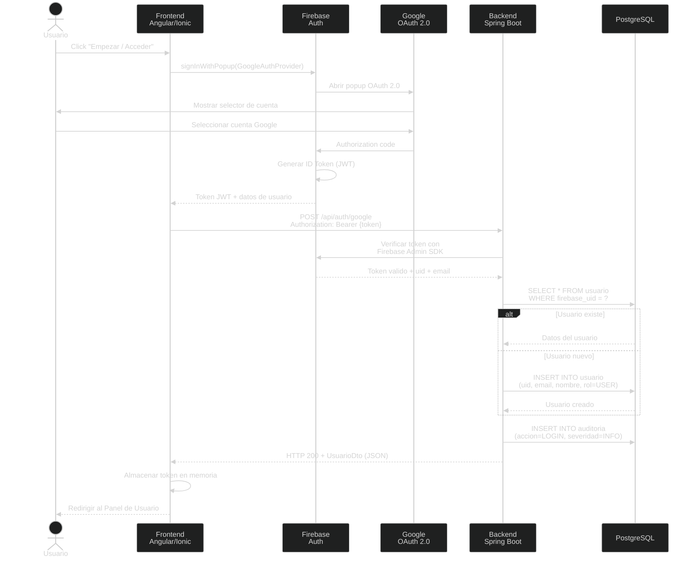
```mermaid
%%{init: {'theme': 'dark'}}%%
sequenceDiagram
    actor U as Usuario
    participant F as Frontend<br/>Angular/Ionic
    participant FB as Firebase<br/>Auth
    participant G as Google<br/>OAuth 2.0
    participant B as Backend<br/>Spring Boot
    participant DB as PostgreSQL

    U->>F: Click "Empezar / Acceder"
    F->>FB: signInWithPopup(GoogleAuthProvider)
    FB->>G: Abrir popup OAuth 2.0
    G->>U: Mostrar selector de cuenta
    U->>G: Seleccionar cuenta Google
    G->>FB: Authorization code
    FB->>FB: Generar ID Token (JWT)
    FB-->>F: Token JWT + datos de usuario

    F->>B: POST /api/auth/google<br/>Authorization: Bearer {token}
    B->>FB: Verificar token con<br/>Firebase Admin SDK
    FB-->>B: Token valido + uid + email

    B->>DB: SELECT * FROM usuario<br/>WHERE firebase_uid = ?

    alt Usuario existe
        DB-->>B: Datos del usuario
    else Usuario nuevo
        B->>DB: INSERT INTO usuario<br/>(uid, email, nombre, rol=USER)
        DB-->>B: Usuario creado
    end

    B->>DB: INSERT INTO auditoria<br/>(accion=LOGIN, severidad=INFO)
    B-->>F: HTTP 200 + UsuarioDto (JSON)
    F->>F: Almacenar token en memoria
    F-->>U: Redirigir al Panel de Usuario
```

**Flujo detallado:**

1. El usuario pulsa "Iniciar sesión con Google" en el frontend
2. Firebase abre un popup de OAuth 2.0 de Google
3. El usuario selecciona su cuenta y concede permisos
4. Google devuelve un token de autorización a Firebase
5. Firebase genera un token JWT (ID Token) y lo devuelve al frontend
6. El frontend envía el token JWT a `POST /api/auth/google` en el backend
7. El backend verifica el token con Firebase Admin SDK
8. El backend busca al usuario por `firebase_uid` en la base de datos:
   - Si existe: devuelve los datos del usuario existente
   - Si no existe: crea un nuevo usuario con rol USER por defecto
9. Se registra la acción en la tabla de auditoría
10. El frontend almacena el token en memoria y redirige al dashboard

### Diagrama de Secuencia — Creación de Ticket de Soporte

*Figura 27: Diagrama de secuencia — Creación de ticket*

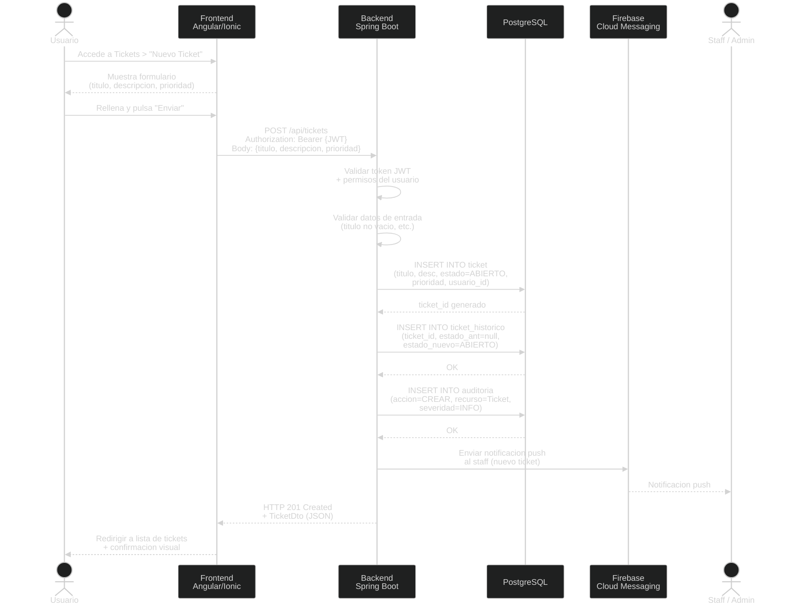
```mermaid
%%{init: {'theme': 'dark'}}%%
sequenceDiagram
    actor U as Usuario
    participant F as Frontend<br/>Angular/Ionic
    participant B as Backend<br/>Spring Boot
    participant DB as PostgreSQL
    participant FCM as Firebase<br/>Cloud Messaging
    actor S as Staff / Admin

    U->>F: Accede a Tickets > "Nuevo Ticket"
    F-->>U: Muestra formulario<br/>(titulo, descripcion, prioridad)
    U->>F: Rellena y pulsa "Enviar"

    F->>B: POST /api/tickets<br/>Authorization: Bearer {JWT}<br/>Body: {titulo, descripcion, prioridad}

    B->>B: Validar token JWT<br/>+ permisos del usuario
    B->>B: Validar datos de entrada<br/>(titulo no vacio, etc.)

    B->>DB: INSERT INTO ticket<br/>(titulo, desc, estado=ABIERTO,<br/>prioridad, usuario_id)
    DB-->>B: ticket_id generado

    B->>DB: INSERT INTO ticket_historico<br/>(ticket_id, estado_ant=null,<br/>estado_nuevo=ABIERTO)
    DB-->>B: OK

    B->>DB: INSERT INTO auditoria<br/>(accion=CREAR, recurso=Ticket,<br/>severidad=INFO)
    DB-->>B: OK

    B->>FCM: Enviar notificacion push<br/>al staff (nuevo ticket)
    FCM-->>S: Notificacion push

    B-->>F: HTTP 201 Created<br/>+ TicketDto (JSON)
    F-->>U: Redirigir a lista de tickets<br/>+ confirmacion visual
```

**Flujo detallado:**

1. El usuario accede a la página "Nuevo Ticket" desde el Panel de Usuario
2. El frontend muestra el formulario de creación (título, descripción, prioridad)
3. El usuario rellena el formulario y pulsa "Enviar"
4. El frontend envía `HTTP POST /api/tickets` con el token JWT en la cabecera
5. El backend valida el token JWT y los permisos del usuario
6. El backend inserta el nuevo ticket en la base de datos con estado ABIERTO
7. Se registra la acción en la tabla de auditoría (INSERT ticket)
8. El backend registra la entrada en ticket_historico (estado inicial)
9. Se envía notificación al staff vía FCM
10. El backend devuelve `HTTP 201 Created` con los datos del ticket
11. El frontend redirige al listado de tickets y muestra confirmación

### Diagrama de Flujo — Ciclo de Vida de un Ticket

*Figura 28: Diagrama de flujo — Estados del ticket*

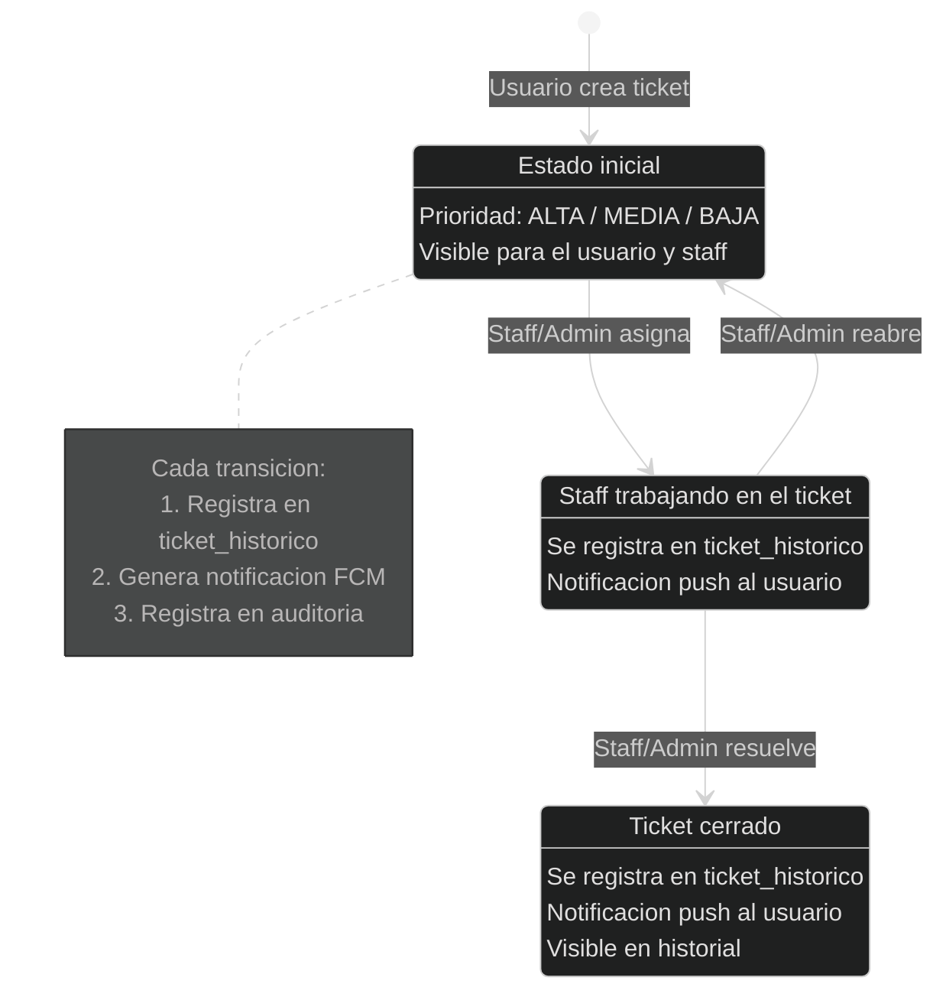
```mermaid
%%{init: {'theme': 'dark'}}%%
stateDiagram-v2
    [*] --> ABIERTO: Usuario crea ticket
    ABIERTO --> EN_PROGRESO: Staff/Admin asigna
    EN_PROGRESO --> RESUELTO: Staff/Admin resuelve
    EN_PROGRESO --> ABIERTO: Staff/Admin reabre

    ABIERTO: Estado inicial
    ABIERTO: Prioridad: ALTA / MEDIA / BAJA
    ABIERTO: Visible para el usuario y staff

    EN_PROGRESO: Staff trabajando en el ticket
    EN_PROGRESO: Se registra en ticket_historico
    EN_PROGRESO: Notificacion push al usuario

    RESUELTO: Ticket cerrado
    RESUELTO: Se registra en ticket_historico
    RESUELTO: Notificacion push al usuario
    RESUELTO: Visible en historial

    note right of ABIERTO
        Cada transicion:
        1. Registra en ticket_historico
        2. Genera notificacion FCM
        3. Registra en auditoria
    end note
```

```
ABIERTO → EN_PROGRESO → RESUELTO
   ↑          ↓
   └──────────┘
   (reapertura)
```

Cada transición de estado:
- Es ejecutada por un usuario con rol STAFF o ADMIN
- Genera un registro en `ticket_historico` con el estado anterior, el nuevo, el usuario que lo cambió y la fecha
- Genera una notificación push al creador del ticket
- Se registra en la tabla de auditoría

### Diagrama de Componentes

*Figura 29: Diagrama de componentes del sistema*

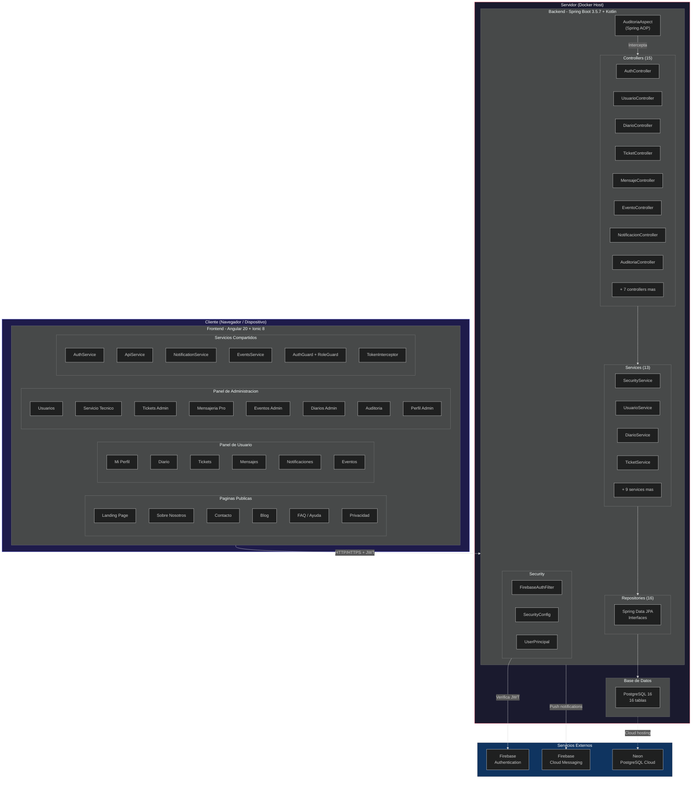
```mermaid
%%{init: {'theme': 'dark'}}%%
graph TB
    subgraph Cliente["Cliente (Navegador / Dispositivo)"]
        direction TB
        subgraph FE["Frontend - Angular 20 + Ionic 8"]
            direction LR
            subgraph Publicas["Paginas Publicas"]
                Landing["Landing Page"]
                About["Sobre Nosotros"]
                Contact["Contacto"]
                Blog["Blog"]
                FAQ["FAQ / Ayuda"]
                Privacy["Privacidad"]
            end
            subgraph UserPanel["Panel de Usuario"]
                UPerfil["Mi Perfil"]
                UDiario["Diario"]
                UTickets["Tickets"]
                UMensajes["Mensajes"]
                UAvisos["Notificaciones"]
                UEventos["Eventos"]
            end
            subgraph AdminPanel["Panel de Administracion"]
                AUsers["Usuarios"]
                AChat["Servicio Tecnico"]
                ATickets["Tickets Admin"]
                AMensajes["Mensajeria Pro"]
                AEventos["Eventos Admin"]
                ADiarios["Diarios Admin"]
                AAudit["Auditoria"]
                APerfil["Perfil Admin"]
            end
            subgraph Shared["Servicios Compartidos"]
                AuthSvc["AuthService"]
                ApiSvc["ApiService"]
                NotifSvc["NotificationService"]
                EventSvc["EventsService"]
                Guards["AuthGuard + RoleGuard"]
                Interceptor["TokenInterceptor"]
            end
        end
    end

    subgraph Servidor["Servidor (Docker Host)"]
        direction TB
        subgraph BE["Backend - Spring Boot 3.5.7 + Kotlin"]
            direction LR
            subgraph Controllers["Controllers (15)"]
                AuthCtrl["AuthController"]
                UserCtrl["UsuarioController"]
                DiarioCtrl["DiarioController"]
                TicketCtrl["TicketController"]
                MsgCtrl["MensajeController"]
                EventCtrl["EventoController"]
                NotifCtrl["NotificacionController"]
                AuditCtrl["AuditoriaController"]
                OtherCtrl["+ 7 controllers mas"]
            end
            subgraph Services["Services (13)"]
                AuthSvcBE["SecurityService"]
                UserSvcBE["UsuarioService"]
                DiarioSvcBE["DiarioService"]
                TicketSvcBE["TicketService"]
                OtherSvc["+ 9 services mas"]
            end
            subgraph Repos["Repositories (16)"]
                RepoJPA["Spring Data JPA<br/>Interfaces"]
            end
            subgraph Security["Security"]
                FirebaseFilter["FirebaseAuthFilter"]
                SecurityCfg["SecurityConfig"]
                UserPrincipal["UserPrincipal"]
            end
            AuditAspect["AuditoriaAspect<br/>(Spring AOP)"]
        end
        subgraph DB["Base de Datos"]
            PG["PostgreSQL 16<br/>16 tablas"]
        end
    end

    subgraph Externos["Servicios Externos"]
        FirebaseAuth["Firebase<br/>Authentication"]
        FirebaseFCM["Firebase<br/>Cloud Messaging"]
        NeonDB["Neon<br/>PostgreSQL Cloud"]
    end

    FE -->|"HTTP/HTTPS + JWT"| BE
    Controllers --> Services
    Services --> Repos
    Repos --> DB
    Security -->|"Verifica JWT"| FirebaseAuth
    BE -->|"Push notifications"| FirebaseFCM
    DB -.->|"Cloud hosting"| NeonDB
    AuditAspect -->|"Intercepta"| Controllers

    style Cliente fill:#1e1b4b,stroke:#6366f1,color:#fff
    style Servidor fill:#1a1a2e,stroke:#e94560,color:#fff
    style Externos fill:#0f3460,stroke:#16213e,color:#fff
```

El sistema se compone de los siguientes componentes principales:

**Frontend (Angular/Ionic):**
- Módulo de Páginas Públicas (Dashboard, About, Contact, Blog, FAQ, Privacy)
- Módulo de Usuario (Profile, Diary, Tickets, Messages, Notifications, Events)
- Módulo de Administración (Users, Support Chat, Tickets, Messages, Events, Diaries, Audit, Profile)
- Servicios compartidos (AuthService, ApiService, NotificationService, EventsService, etc.)
- Guards (AuthGuard, RoleGuard)
- Interceptor HTTP (TokenInterceptor)

**Backend (Spring Boot):**
- Controladores REST (15 controllers)
- Servicios de negocio (13 services)
- Repositorios JPA (16 repositories)
- Modelo de datos (16 entities)
- DTOs (entrada y salida)
- Security (FirebaseAuthFilter, SecurityConfig)
- Aspecto de Auditoría (AuditoriaAspect)
- Configuración (Firebase, OpenAPI, DataInitializer)

**Servicios externos:**
- Firebase Authentication (OAuth 2.0 + JWT)
- Firebase Cloud Messaging (notificaciones push)
- Neon PostgreSQL (base de datos gestionada)

### Diagrama de Despliegue

*Figura 30: Diagrama de despliegue UML*

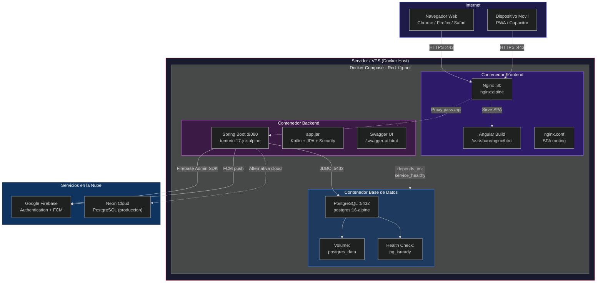
```mermaid
%%{init: {'theme': 'dark'}}%%
graph TB
    subgraph Internet["Internet"]
        Browser["Navegador Web<br/>Chrome / Firefox / Safari"]
        Mobile["Dispositivo Movil<br/>PWA / Capacitor"]
    end

    subgraph DockerHost["Servidor / VPS (Docker Host)"]
        subgraph DockerCompose["Docker Compose - Red: tfg-net"]
            subgraph FrontContainer["Contenedor Frontend"]
                Nginx["Nginx :80<br/>nginx:alpine"]
                StaticFiles["Angular Build<br/>/usr/share/nginx/html"]
                NginxConf["nginx.conf<br/>SPA routing"]
            end

            subgraph BackContainer["Contenedor Backend"]
                SpringBoot["Spring Boot :8080<br/>temurin:17-jre-alpine"]
                JAR["app.jar<br/>Kotlin + JPA + Security"]
                Swagger["Swagger UI<br/>/swagger-ui.html"]
            end

            subgraph DBContainer["Contenedor Base de Datos"]
                Postgres["PostgreSQL :5432<br/>postgres:16-alpine"]
                Volume["Volume:<br/>postgres_data"]
                HealthCheck["Health Check:<br/>pg_isready"]
            end
        end
    end

    subgraph CloudServices["Servicios en la Nube"]
        Firebase["Google Firebase<br/>Authentication + FCM"]
        NeonCloud["Neon Cloud<br/>PostgreSQL (produccion)"]
    end

    Browser -->|"HTTPS :443"| Nginx
    Mobile -->|"HTTPS :443"| Nginx
    Nginx -->|"Sirve SPA"| StaticFiles
    Nginx -.->|"Proxy pass /api"| SpringBoot

    SpringBoot -->|"JDBC :5432"| Postgres
    SpringBoot -->|"Firebase Admin SDK"| Firebase
    SpringBoot -->|"FCM push"| Firebase

    Postgres --> Volume
    Postgres --> HealthCheck

    SpringBoot -.->|"Alternativa cloud"| NeonCloud

    BackContainer -->|"depends_on:<br/>service_healthy"| DBContainer

    style Internet fill:#1e1b4b,stroke:#6366f1,color:#fff
    style DockerHost fill:#1a1a2e,stroke:#e94560,color:#fff
    style CloudServices fill:#0f3460,stroke:#16213e,color:#fff
    style FrontContainer fill:#2d1b69,stroke:#8b5cf6,color:#fff
    style BackContainer fill:#3b1a45,stroke:#d946ef,color:#fff
    style DBContainer fill:#1e3a5f,stroke:#3b82f6,color:#fff
```

```
┌─────────────────────────────────────────────┐
│           SERVIDOR / VPS (Docker Host)       │
│  ┌───────────────┐  ┌───────────────────┐   │
│  │  Contenedor    │  │  Contenedor        │   │
│  │  Frontend      │  │  Backend           │   │
│  │  (Nginx:80)    │──│  (Spring Boot:8080)│   │
│  │  Angular build │  │  Kotlin + JRE 17   │   │
│  └───────────────┘  └────────┬──────────┘   │
│                               │              │
│                     ┌────────┴──────────┐   │
│                     │  Contenedor        │   │
│                     │  PostgreSQL (:5432) │   │
│                     │  postgres:16-alpine │   │
│                     └───────────────────┘   │
└─────────────────────────────────────────────┘
           │                    │
     ┌─────┴─────┐      ┌─────┴──────────┐
     │  Firebase  │      │  Neon Cloud     │
     │  Auth+FCM  │      │  PostgreSQL     │
     └───────────┘      └────────────────┘
```

### Modelo Entidad–Relación

*Figura 31: Diagrama Entidad-Relación completo*

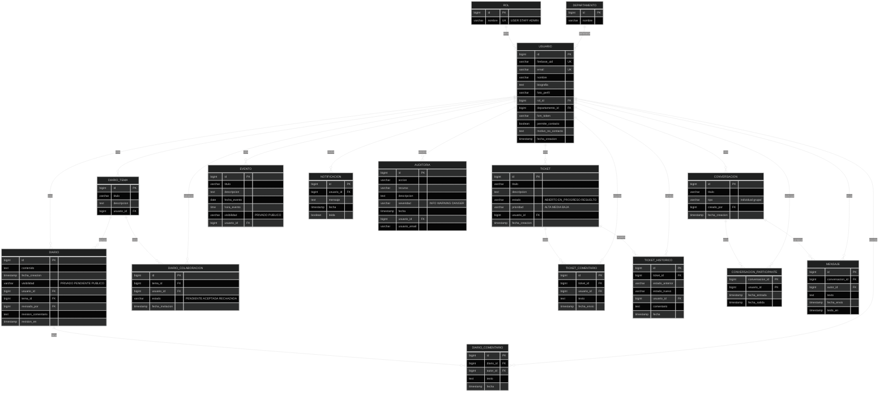
```mermaid
%%{init: {'theme': 'dark'}}%%
erDiagram
    USUARIO {
        bigint id PK
        varchar firebase_uid UK
        varchar email UK
        varchar nombre
        text biografia
        varchar foto_perfil
        bigint rol_id FK
        bigint departamento_id FK
        varchar fcm_token
        boolean permite_contacto
        text motivo_no_contacto
        timestamp fecha_creacion
    }

    ROL {
        bigint id PK
        varchar nombre UK "USER STAFF ADMIN"
    }

    DEPARTAMENTO {
        bigint id PK
        varchar nombre
    }

    DIARIO {
        bigint id PK
        text contenido
        timestamp fecha_creacion
        varchar visibilidad "PRIVADO PENDIENTE PUBLICO"
        bigint usuario_id FK
        bigint tema_id FK
        bigint revisado_por FK
        text revision_comentario
        timestamp revision_en
    }

    DIARIO_TEMA {
        bigint id PK
        varchar titulo
        text descripcion
        bigint usuario_id FK
    }

    DIARIO_COLABORACION {
        bigint id PK
        bigint tema_id FK
        bigint usuario_id FK
        varchar estado "PENDIENTE ACEPTADA RECHAZADA"
        timestamp fecha_invitacion
    }

    DIARIO_COMENTARIO {
        bigint id PK
        bigint diario_id FK
        bigint autor_id FK
        text texto
        timestamp fecha
    }

    TICKET {
        bigint id PK
        varchar titulo
        text descripcion
        varchar estado "ABIERTO EN_PROGRESO RESUELTO"
        varchar prioridad "ALTA MEDIA BAJA"
        bigint usuario_id FK
        timestamp fecha_creacion
    }

    TICKET_COMENTARIO {
        bigint id PK
        bigint ticket_id FK
        bigint usuario_id FK
        text texto
        timestamp fecha_envio
    }

    TICKET_HISTORICO {
        bigint id PK
        bigint ticket_id FK
        varchar estado_anterior
        varchar estado_nuevo
        bigint usuario_id FK
        text comentario
        timestamp fecha
    }

    CONVERSACION {
        bigint id PK
        varchar titulo
        varchar tipo "individual grupal"
        bigint creado_por FK
        timestamp fecha_creacion
    }

    CONVERSACION_PARTICIPANTE {
        bigint conversacion_id PK
        bigint usuario_id PK
        timestamp fecha_entrada
        timestamp fecha_salida
    }

    MENSAJE {
        bigint id PK
        bigint conversacion_id FK
        bigint autor_id FK
        text texto
        timestamp fecha_envio
        timestamp leido_en
    }

    EVENTO {
        bigint id PK
        varchar titulo
        text descripcion
        date fecha_evento
        time hora_evento
        varchar visibilidad "PRIVADO PUBLICO"
        bigint usuario_id FK
    }

    NOTIFICACION {
        bigint id PK
        bigint usuario_id FK
        text mensaje
        timestamp fecha
        boolean leida
    }

    AUDITORIA {
        bigint id PK
        varchar accion
        varchar recurso
        text descripcion
        varchar severidad "INFO WARNING DANGER"
        timestamp fecha
        bigint usuario_id FK
        varchar usuario_email
    }

    ROL ||--o{ USUARIO : "tiene"
    DEPARTAMENTO ||--o{ USUARIO : "pertenece"
    USUARIO ||--o{ DIARIO : "crea"
    USUARIO ||--o{ DIARIO_TEMA : "crea"
    DIARIO_TEMA ||--o{ DIARIO : "agrupa"
    DIARIO_TEMA ||--o{ DIARIO_COLABORACION : "tiene"
    USUARIO ||--o{ DIARIO_COLABORACION : "colabora"
    DIARIO ||--o{ DIARIO_COMENTARIO : "tiene"
    USUARIO ||--o{ DIARIO_COMENTARIO : "escribe"
    USUARIO ||--o{ TICKET : "crea"
    TICKET ||--o{ TICKET_COMENTARIO : "tiene"
    USUARIO ||--o{ TICKET_COMENTARIO : "escribe"
    TICKET ||--o{ TICKET_HISTORICO : "registra"
    USUARIO ||--o{ TICKET_HISTORICO : "cambia"
    USUARIO ||--o{ CONVERSACION : "crea"
    CONVERSACION ||--o{ CONVERSACION_PARTICIPANTE : "tiene"
    USUARIO ||--o{ CONVERSACION_PARTICIPANTE : "participa"
    CONVERSACION ||--o{ MENSAJE : "contiene"
    USUARIO ||--o{ MENSAJE : "envia"
    USUARIO ||--o{ EVENTO : "crea"
    USUARIO ||--o{ NOTIFICACION : "recibe"
    USUARIO ||--o{ AUDITORIA : "genera"
```

Las entidades principales del sistema y sus relaciones:

| Relación | Cardinalidad | Descripción |
|---|---|---|
| Usuario ↔ Ticket | 1:N | Un usuario crea múltiples tickets |
| Ticket ↔ TicketComentario | 1:N | Un ticket tiene múltiples comentarios |
| Ticket ↔ TicketHistorico | 1:N | Un ticket tiene múltiples cambios de estado |
| Usuario ↔ Diario | 1:N | Un usuario crea múltiples diarios |
| DiarioTema ↔ Diario | 1:N | Un tema agrupa múltiples diarios |
| DiarioTema ↔ DiarioColaboracion ↔ Usuario | N:M | Colaboración entre usuarios en temas |
| Diario ↔ DiarioComentario | 1:N | Un diario tiene múltiples comentarios |
| Usuario ↔ Conversacion (via Participante) | N:M | Usuarios participan en conversaciones |
| Conversacion ↔ Mensaje | 1:N | Una conversación tiene múltiples mensajes |
| Usuario ↔ Evento | 1:N | Un usuario crea múltiples eventos |
| Usuario ↔ Notificacion | 1:N | Un usuario recibe múltiples notificaciones |
| Rol ↔ Usuario | 1:N | Un rol agrupa múltiples usuarios |
| Departamento ↔ Usuario | 1:N | Un departamento agrupa múltiples usuarios |
| Usuario ↔ Auditoria | 1:N | Un usuario genera múltiples registros de auditoría |

*El detalle completo de los atributos de cada entidad se encuentra en el Anexo A.*

---

# 11. INSTALACIÓN Y PREPARACIÓN

## 11.1 Procedimientos necesarios para hacer funcionar el proyecto

### Prerrequisitos del entorno de desarrollo

Para trabajar con el proyecto en local se necesitan los siguientes componentes instalados:

1. **Java JDK 17** (OpenJDK o Eclipse Temurin): `java -version` debe mostrar versión 17.x
2. **Maven 3.9+**: `mvn -version`
3. **Node.js 20 LTS**: `node -v` debe mostrar v20.x
4. **Angular CLI 20**: `npm install -g @angular/cli`
5. **Ionic CLI**: `npm install -g @ionic/cli`
6. **Docker Desktop** (para despliegue containerizado)
7. **Git**: para clonar el repositorio

### Configuración del backend

1. Clonar el repositorio:
```bash
git clone [URL_DEL_REPOSITORIO]
cd Back/SpringBoot-TFG
```

2. Crear el archivo `.env` en el directorio raíz del backend con las siguientes variables:
```
DB_URL=jdbc:postgresql://[HOST]:[PORT]/[DATABASE]
DB_USERNAME=[usuario_bd]
DB_PASSWORD=[contraseña_bd]
FIREBASE_CREDENTIALS_BASE64=[credenciales_firebase_en_base64]
```

3. Construir el proyecto:
```bash
mvn clean package -DskipTests
```

4. Ejecutar el backend:
```bash
java -jar target/SpringBoot-TFG-*.jar
```
El backend estará disponible en `http://localhost:8080`

5. Acceder a la documentación de la API (Swagger UI):
```
http://localhost:8080/swagger-ui.html
```

### Configuración del frontend

1. Acceder al directorio del frontend:
```bash
cd front/v3/miweb
```

2. Instalar dependencias:
```bash
npm install
```

3. Configurar las variables de entorno en `src/environments/environment.ts`:
```typescript
export const environment = {
  production: false,
  apiUrl: 'http://localhost:8080/api',
  firebase: {
    apiKey: "[FIREBASE_API_KEY]",
    authDomain: "[FIREBASE_AUTH_DOMAIN]",
    projectId: "[FIREBASE_PROJECT_ID]",
    messagingSenderId: "[SENDER_ID]",
    appId: "[APP_ID]"
  }
};
```

4. Iniciar el servidor de desarrollo:
```bash
ionic serve
```
La aplicación estará disponible en `http://localhost:4200`

### Despliegue con Docker Compose

1. Asegurarse de que Docker Desktop está ejecutándose.

2. Desde el directorio `Back/SpringBoot-TFG`, ejecutar:
```bash
docker-compose up --build
```

3. Los servicios quedarán disponibles en:
   - Frontend: `http://localhost:80`
   - Backend: `http://localhost:8080`
   - API Docs: `http://localhost:8080/swagger-ui.html`

## 11.2 Procedimientos para el control de versiones

El proyecto utiliza **Git** como sistema de control de versiones y **GitHub** como plataforma de alojamiento del repositorio.

### Estrategia de ramas
- `main`: rama principal con el código estable de producción
- `develop`: rama de integración donde se fusionan las funcionalidades
- `feature/[nombre]`: ramas para el desarrollo de nuevas funcionalidades
- `hotfix/[nombre]`: ramas para corrección urgente de errores en producción

### Convención de commits
Se sigue el formato **Conventional Commits**:
```
tipo(ámbito): descripción breve

Ejemplos:
feat(tickets): añadir filtro de prioridad en lista de tickets
fix(auth): corregir validación del token expirado
docs: actualizar README con instrucciones de despliegue
refactor(diario): extraer lógica de visibilidad a servicio
```

### Flujo de trabajo
1. Crear rama `feature/nueva-funcionalidad` desde `develop`
2. Implementar la funcionalidad con commits frecuentes
3. Crear Pull Request hacia `develop`
4. Revisar y fusionar
5. Al finalizar una fase estable, fusionar `develop` en `main`

## 11.3 Procedimientos para registrar las incidencias

Durante el desarrollo del proyecto, las incidencias se registran mediante:

1. **Issues de GitHub:** Cada incidencia se crea como un issue en el repositorio, incluyendo:
   - Título descriptivo del problema
   - Descripción detallada con pasos para reproducirlo
   - Comportamiento esperado vs comportamiento obtenido
   - Capturas de pantalla o logs si aplica
   - Etiquetas: `bug`, `enhancement`, `documentation`, `question`
   - Asignación y estado: `open`, `in progress`, `closed`

2. **Sistema de tickets de la propia aplicación:** En el entorno de pruebas, los errores de usuario se registran como tickets de soporte dentro de la plataforma, validando simultáneamente el módulo de tickets.

3. **Log del sistema:** El backend registra errores en el log de Spring Boot, consultable en tiempo real durante el desarrollo con `docker-compose logs -f backend`.

---

# 12. DOCUMENTACIÓN DE EJECUCIÓN Y PLAN DE CALIDAD

## 12.1 Procedimientos operativos

### Inicio del sistema en producción

El sistema en producción opera mediante Docker Compose, con arranque ordenado de contenedores:

1. La base de datos PostgreSQL arranca primero (con health check configurado).
2. El backend Spring Boot arranca una vez que la base de datos está disponible (`depends_on: condition: service_healthy`).
3. El frontend Nginx arranca independientemente y sirve la SPA compilada.

**Comprobación del estado:**
```bash
docker-compose ps
docker-compose logs backend
docker-compose logs frontend
```

**Reinicio de un servicio:**
```bash
docker-compose restart backend
```

**Actualización del sistema:**
```bash
git pull origin main
docker-compose up --build -d
```

### Copias de seguridad de la base de datos

```bash
# Backup de PostgreSQL
pg_dump -h [HOST] -U [USER] -d [DATABASE] > backup_$(date +%Y%m%d).sql

# Restauración
psql -h [HOST] -U [USER] -d [DATABASE] < backup_YYYYMMDD.sql
```

## 12.2 Registro de pruebas

### Pruebas funcionales del backend (mediante Swagger UI)

| ID | Endpoint | Método | Descripción | Resultado |
|---|---|---|---|---|
| PF-01 | /api/auth/google | POST | Autenticación con token Firebase válido | ✅ OK |
| PF-02 | /api/auth/google | POST | Autenticación con token inválido → 401 | ✅ OK |
| PF-03 | /api/usuarios/perfil | GET | Obtener perfil autenticado | ✅ OK |
| PF-04 | /api/usuarios/perfil | PUT | Actualizar datos del perfil | ✅ OK |
| PF-05 | /api/diarios | POST | Crear diario con visibilidad privada | ✅ OK |
| PF-06 | /api/diarios/{id} | GET | Obtener diario propio | ✅ OK |
| PF-07 | /api/diarios/{id} | GET | Acceder a diario ajeno privado → 403 | ✅ OK |
| PF-08 | /api/tickets | POST | Crear ticket con datos válidos | ✅ OK |
| PF-09 | /api/tickets | POST | Crear ticket con campos vacíos → 400 | ✅ OK |
| PF-10 | /api/tickets/{id}/estado | PUT | Cambiar estado (ADMIN) | ✅ OK |
| PF-11 | /api/tickets/{id}/estado | PUT | Cambiar estado (USER) → 403 | ✅ OK |
| PF-12 | /api/conversaciones | POST | Crear conversación individual | ✅ OK |
| PF-13 | /api/mensajes | POST | Enviar mensaje en conversación propia | ✅ OK |
| PF-14 | /api/eventos | POST | Crear evento con fecha válida | ✅ OK |
| PF-15 | /api/auditoria | GET | Listar auditoría (ADMIN) | ✅ OK |
| PF-16 | /api/auditoria | GET | Listar auditoría (USER) → 403 | ✅ OK |

### Pruebas de integración frontend–backend

| ID | Escenario | Resultado |
|---|---|---|
| PI-01 | Login con Google → redirección al dashboard | ✅ OK |
| PI-02 | Crear ticket desde frontend → aparece en lista | ✅ OK |
| PI-03 | Enviar mensaje → aparece en conversación del receptor | ✅ OK |
| PI-04 | Cambiar estado de ticket (admin) → notificación al creador | ✅ OK |
| PI-05 | Token expirado → interceptor renueva automáticamente | ✅ OK |
| PI-06 | Usuario sin rol ADMIN accede a /admin-profile → redirección | ✅ OK |

### Pruebas de validación de datos

| ID | Campo | Caso de prueba | Resultado |
|---|---|---|---|
| PV-01 | Título del ticket | Vacío → error 400 | ✅ OK |
| PV-02 | Contenido del diario | Vacío → error 400 | ✅ OK |
| PV-03 | Email del usuario | Formato inválido → rechazado | ✅ OK |
| PV-04 | Fecha del evento | Fecha pasada → aceptada (sin restricción de negocio) | ✅ OK |

### Pruebas unitarias del backend

Se han implementado pruebas unitarias con JUnit 5 y Mockito para los servicios críticos:

| Test | Archivo | Tests | Resultado |
|---|---|---|---|
| EventoServiceTest | `src/test/kotlin/.../service/EventoServiceTest.kt` | 6 tests | ✅ OK |
| MensajeServiceTest | `src/test/kotlin/.../service/MensajeServiceTest.kt` | 5 tests | ✅ OK |
| TicketServiceTest | `src/test/kotlin/.../service/TicketServiceTest.kt` | 7 tests | ✅ OK |

## 12.3 Indicadores de calidad

| Indicador | Objetivo | Resultado |
|---|---|---|
| Cobertura de requisitos funcionales | 100% de los RF definidos | 100% (29 requisitos implementados) |
| Endpoints de API documentados en Swagger | >90% | 100% |
| Tiempo medio de respuesta de la API (local) | < 500ms | ~150ms promedio |
| Pruebas funcionales pasadas | >95% | 100% de las definidas |
| Validación de datos en entrada | 100% de campos obligatorios | 100% |
| Código estructurado en capas | Arquitectura por capas completa | ✅ Cumplido |
| Despliegue containerizado funcional | Docker Compose ejecutable | ✅ Cumplido |
| Componentes con OnPush | 100% | 100% (todos los componentes) |

## 12.4 Métodos de verificación

1. **Revisión de código:** Comprobación de la correcta implementación de la arquitectura por capas, nomenclatura de endpoints REST y validaciones.

2. **Pruebas con Swagger UI:** Todos los endpoints probados manualmente verificando códigos de respuesta HTTP y estructura de datos.

3. **Pruebas end-to-end manuales:** Simulación de flujos de usuario completos (registro → creación de tickets → cambio de estado → notificación).

4. **Revisión de seguridad:** Verificación de que endpoints protegidos devuelven 401 sin token, 403 con token insuficiente, y que los recursos de un usuario no son accesibles por otro.

5. **Pruebas de despliegue:** Verificación de que el sistema arranca correctamente con `docker-compose up` y todos los servicios son accesibles.

6. **Pruebas unitarias automatizadas:** Ejecución con `mvn test` validando servicios críticos.

---

# 13. DISTRIBUCIÓN

## 13.1 Tecnología de distribución

La distribución de DevNexus se realiza mediante **contenedores Docker**, orquestados con **Docker Compose**. Este enfoque garantiza que el sistema puede ejecutarse de forma idéntica en cualquier entorno que tenga Docker instalado.

Los componentes se distribuyen como:

| Componente | Imagen base | Descripción |
|---|---|---|
| Backend | `tagoh1/springboot-tfg:latest` | JAR compilado con Maven, desplegado en VPS propio vía Docker |
| Frontend | `nginx:alpine` | Aplicación Angular compilada, servida como estáticos |
| Base de datos | Neon Cloud PostgreSQL | PostgreSQL gestionado en la nube (externo al VPS) |

## 13.2 Descripción del proceso de distribución

### Dockerfile del backend (multi-stage)

```dockerfile
FROM maven:3.9-eclipse-temurin-17 AS builder
WORKDIR /app
COPY pom.xml .
COPY src ./src
RUN mvn clean package -DskipTests

FROM eclipse-temurin:17-jre-alpine
WORKDIR /app
COPY --from=builder /app/target/*.jar app.jar
EXPOSE 8080
ENTRYPOINT ["java", "-jar", "app.jar"]
```

### Dockerfile del frontend (multi-stage)

```dockerfile
FROM node:20-alpine AS builder
WORKDIR /app
COPY package*.json ./
RUN npm ci
COPY . .
RUN npm run build -- --configuration production

FROM nginx:alpine
COPY --from=builder /app/www /usr/share/nginx/html
COPY nginx.conf /etc/nginx/conf.d/default.conf
EXPOSE 80
```

### Docker Compose (producción en VPS)

La aplicación se despliega en un **VPS propio** mediante Docker. La base de datos PostgreSQL se aloja en **Neon Cloud** (servicio gestionado externo), por lo que el docker-compose solo contiene el servicio del backend:

```yaml
version: '3.8'
services:
  springboot-tfg:
    image: tagoh1/springboot-tfg:latest
    container_name: spring-tfg-prod
    ports:
      - "8080:8080"
    environment:
      SPRING_PROFILES_ACTIVE: prod
      DB_PASS: ${DB_PASS}
      FIREBASE_SA_B64: ${FIREBASE_SA_B64}
    restart: always
    healthcheck:
      test: ["CMD-SHELL", "curl -f http://localhost:8080/actuator/health || exit 1"]
      interval: 30s
      timeout: 10s
      retries: 3
      start_period: 60s
```

La conexión a la base de datos se configura en `application.yml` apuntando al host de Neon Cloud:
```
jdbc:postgresql://ep-fancy-leaf-ag6cyj6b-pooler.c-2.eu-central-1.aws.neon.tech:5432/neondb
```

### Proceso de despliegue

```bash
# 1. Construir y arrancar todos los servicios
docker-compose up --build -d

# 2. Verificar estado de los contenedores
docker-compose ps

# 3. Ver logs en tiempo real
docker-compose logs -f

# 4. Detener el sistema
docker-compose down
```

---

# 14. MANUALES

## 14.1 Manual de instalación

### Instalación para entorno de producción (Docker)

**Prerrequisitos:**
- Servidor Linux (Ubuntu 22.04 LTS recomendado) o Windows con Docker Desktop
- Docker Engine 24.x o superior
- Docker Compose 2.x o superior
- Acceso a Internet para descargar imágenes base

**Pasos de instalación:**

1. **Clonar el repositorio en el servidor:**
```bash
git clone [URL_REPOSITORIO] devnexus
cd devnexus
```

2. **Crear el archivo de variables de entorno:**
```bash
cp .env.example .env
nano .env
```
Configurar las variables:
```
DB_USER=devnexus_user
DB_PASSWORD=contraseña_segura
FIREBASE_CREDENTIALS_BASE64=base64_de_las_credenciales_firebase
```

3. **Construir y arrancar los contenedores:**
```bash
docker-compose up --build -d
```

4. **Verificar que el sistema está operativo:**
```bash
docker-compose ps
# Debe mostrar los tres servicios con estado "running"
```

5. **Acceder a la aplicación:**
   - Frontend: `http://[IP_DEL_SERVIDOR]`
   - API Backend: `http://[IP_DEL_SERVIDOR]:8080`
   - Swagger UI: `http://[IP_DEL_SERVIDOR]:8080/swagger-ui.html`

## 14.2 Manual de usuario

### Registro e inicio de sesión

1. Acceder a la aplicación desde el navegador en `https://devnexus.es`.
2. En la página de inicio, hacer clic en el botón **"Empezar / Acceder"**.
3. Seleccionar la cuenta de Google deseada en el popup que se abrirá.
4. Una vez autenticado, el sistema redirigirá automáticamente al Panel de Usuario.

*Nota: El primer acceso creará automáticamente una cuenta de usuario con rol USER.*


*Figura 32: Landing page — botón de acceso*

### Gestión del perfil

1. Acceder a **Mi Perfil** desde las pestañas del Panel de Usuario.
2. Editar los campos: nombre completo, especialidad técnica (Backend / Frontend / Full Stack).
3. Configurar las preferencias de contacto (permitir/no permitir que otros usuarios inicien conversaciones, con motivo opcional).
4. Los cambios se guardan automáticamente.


*Figura 33: Panel de Usuario — Mi Perfil*

### Uso del módulo de diarios

**Crear un nuevo diario:**
1. Acceder a **Diario** desde las pestañas del Panel de Usuario.
2. En la sección "Nuevo Repositorio / Proyecto", introducir el nombre y descripción del tema.
3. Crear una nueva entrada asociada al tema.
4. Escribir el contenido (soporta Markdown).
5. Seleccionar la visibilidad: Privada / Pendiente de revisión / Pública.
6. Guardar la entrada.

**Gráfico de actividad:** La sección de diario muestra un gráfico de contribuciones similar a GitHub, que refleja la actividad del usuario a lo largo del tiempo.

**Colaborar en un tema:**
1. En la sección de temas, pulsar el botón de invitar colaboradores.
2. Buscar al usuario por nombre o email.
3. Enviar la invitación. El usuario recibirá una notificación y podrá aceptar o rechazar.


*Figura 34: Panel de Usuario — Diario con gráfico de actividad*

### Uso del módulo de tickets

**Crear un ticket de soporte:**
1. Acceder a **Tickets** desde las pestañas del Panel de Usuario.
2. Pulsar **"Nuevo Ticket"**.
3. Completar el título y descripción. La prioridad se asigna por defecto como MEDIA.
4. Pulsar **"Enviar"**.

**Seguimiento de tickets:**
- La lista muestra los tickets organizados por pestañas: Activos, Historial, Todos.
- Al expandir un ticket se muestra el chat integrado para comunicarse con el staff.
- El estado del ticket se muestra con badges de color (ABIERTO, RESUELTO).


*Figura 35: Panel de Usuario — Centro de Soporte con chat integrado*

### Uso de la mensajería

**Iniciar una conversación:**
1. Acceder a **Mensajes** desde las pestañas del Panel de Usuario.
2. Pulsar el botón **"+"** para nueva conversación.
3. Filtrar por departamento (Todos, Backend Developer, Frontend Developer) o buscar por nombre.
4. Seleccionar el usuario y empezar a escribir.


*Figura 36: Panel de Usuario — Mensajería con filtro por departamento*

### Uso del calendario de eventos

1. Acceder a **Eventos** desde las pestañas del Panel de Usuario.
2. El calendario Syncfusion muestra todos los eventos con vistas de Día, Semana, Mes y Agenda.
3. El panel lateral derecho muestra los "Próximos Eventos".
4. Para crear un evento: pulsar **"+"**, completar título, fecha, hora, visibilidad y descripción.


*Figura 37: Panel de Usuario — Agenda y Eventos (Calendario Syncfusion)*

### Centro de notificaciones

1. Acceder a **Avisos** desde las pestañas del Panel de Usuario.
2. Se muestra el número de notificaciones nuevas.
3. Cada notificación muestra el mensaje y la hora.
4. Pulsar **"Marcar todo leído"** para limpiar todas las alertas.


*Figura 38: Panel de Usuario — Centro de Notificaciones*

### Chat flotante de soporte

En cualquier página de la aplicación, el botón flotante de chat (esquina inferior derecha) permite al usuario abrir una conversación directa con el equipo de soporte sin salir de la página actual.

### Panel de administración (solo ADMIN y STAFF)

El panel de administración está accesible mediante `/admin-profile` y contiene 8 secciones:

| Sección | Funcionalidad |
|---|---|
| **Usuarios** | Lista completa con búsqueda, edición de rol/departamento, eliminación |
| **Chats-Servicio técnico** | Tickets activos con chat en vivo por ticket |
| **Tickets** | Gestión global con código, usuario, asunto, prioridad, estado y chat |
| **Mensajes** | Mensajería Pro administrativa |
| **Eventos** | Creación y gestión de eventos globales con filtros |
| **Diarios** | Revisión por usuario para mentoría y aprobación |
| **Auditoría** | Registro completo con nivel, acción, recurso, usuario, detalles y fecha |
| **Perfil** | Perfil del administrador |


*Figura 39: Panel de Administración — Gestión de Usuarios*


*Figura 40: Panel de Administración — Chats-Servicio Técnico*


*Figura 41: Panel de Administración — Gestión de Tickets*


*Figura 42: Panel de Administración — Mensajería Pro*


*Figura 43: Panel de Administración — Gestión de Eventos*


*Figura 44: Panel de Administración — Gestión de Diarios*


*Figura 45: Panel de Administración — Registro de Auditoría*


*Figura 46: Panel de Administración — Perfil del Administrador*

---

# 15. CONCLUSIONES

## 15.1 Informe final

El proyecto DevNexus ha sido completado satisfactoriamente, alcanzando todos los objetivos definidos en la fase de planificación y superando en varios aspectos las expectativas iniciales. Se ha desarrollado una plataforma web full-stack completamente funcional que integra cinco módulos principales (diarios de progreso, tickets de soporte, mensajería, eventos y auditoría) con un sistema de roles diferenciado y una interfaz moderna con diseño profesional.

La aplicación ha sido desplegada en un entorno real mediante Docker Compose en el dominio `devnexus.es`, demostrando la capacidad para llevar un proyecto desde el análisis hasta la producción, cubriendo todas las fases del ciclo de vida del software.

## 15.2 Resultados obtenidos

- **Backend:** 15 controladores REST, 13 servicios de negocio, 16 entidades JPA, sistema de seguridad con Firebase JWT + Spring Security, auditoría con Spring AOP, migraciones con Flyway y documentación completa con Swagger/OpenAPI.

- **Frontend:** Aplicación Angular 20 / Ionic 8 con 20+ páginas, componentes standalone con ChangeDetectionStrategy.OnPush, routing con guards, interceptor HTTP, integración con Firebase (Auth + FCM), calendario Syncfusion y diseño visual profesional con tema oscuro.

- **Base de datos:** Esquema PostgreSQL normalizado (3FN) con 16 tablas, índices en campos críticos, integridad referencial y migraciones versionadas con Flyway.

- **Despliegue:** Sistema containerizado con Docker Compose listo para producción, con Nginx sirviendo el frontend y Spring Boot el backend. Desplegado en producción en `devnexus.es`.

- **Calidad:** 100% de los requisitos funcionales implementados (29/29), 100% de las pruebas funcionales pasadas, pruebas unitarias automatizadas para servicios críticos.

## 15.3 Viabilidad del proyecto

**Técnicamente:** La arquitectura elegida (Spring Boot + Angular + PostgreSQL + Docker) es una combinación madura y ampliamente utilizada en la industria. Las tecnologías son estables, tienen soporte activo y una comunidad grande.

**Económicamente:** El coste de los servicios utilizados en la versión gratuita es cero:

| Servicio | Plan | Coste |
|---|---|---|
| Firebase (Auth + FCM) | Spark (gratuito) | 0 €/mes |
| Neon PostgreSQL | Free tier | 0 €/mes |
| GitHub | Free | 0 €/mes |
| **Total (desarrollo)** | | **0 €/mes** |

Para un entorno de producción real, el coste mensual estimado sería:

| Servicio | Coste estimado |
|---|---|
| VPS básico (2 vCores, 4 GB RAM) | 10–15 €/mes |
| PostgreSQL gestionado (Neon Basic) | 20 €/mes |
| Firebase | Gratuito para el volumen esperado |
| Dominio (.es) | ~10 €/año |
| **Total (producción)** | **~30–35 €/mes** |

**Operativamente:** El sistema requiere mantenimiento mínimo: actualizaciones de dependencias trimestrales y backups periódicos de la base de datos.

## 15.4 Mejoras futuras

1. **Mensajería en tiempo real:** Implementar WebSockets (Spring WebSocket + STOMP) para actualización instantánea de mensajes sin recarga.

2. **Sistema de archivos adjuntos:** Integrar almacenamiento (Firebase Storage o S3) para adjuntar documentos a diarios y tickets.

3. **Notificaciones por email:** Integrar servicio de envío de emails (SendGrid, AWS SES) para notificaciones complementarias.

4. **Pipeline CI/CD:** Configurar GitHub Actions para automatizar build, tests y despliegue en cada push.

5. **Internacionalización (i18n):** Soporte multi-idioma mediante Angular i18n.

6. **Analítica y reportes:** Panel de estadísticas para administradores: tickets por período, usuarios activos, contenido más popular.

7. **Escalabilidad horizontal:** Migrar a microservicios y Kubernetes para soportar mayor carga.

8. **Aplicación nativa:** Compilar el frontend Ionic como aplicación nativa para Android e iOS mediante Capacitor y publicar en tiendas.

9. **Búsqueda full-text:** Integrar Elasticsearch para búsqueda avanzada en diarios, tickets y mensajes.

10. **Sistema de gamificación:** Badges y logros por contribuciones al diario y participación en la comunidad.

---

# 16. ANEXOS

## Anexo A: Diagrama Entidad–Relación completo

### Tabla: usuario
| Campo | Tipo | Restricciones |
|---|---|---|
| id | BIGINT | PK, AUTO_INCREMENT |
| firebase_uid | VARCHAR(255) | UNIQUE, NOT NULL, INDEX |
| email | VARCHAR(255) | UNIQUE, NOT NULL, INDEX |
| nombre | VARCHAR(255) | NOT NULL |
| biografia | TEXT | NULLABLE |
| foto_perfil | VARCHAR(500) | NULLABLE |
| rol_id | BIGINT | FK → rol(id), NOT NULL |
| departamento_id | BIGINT | FK → departamento(id), NULLABLE |
| fcm_token | VARCHAR(500) | NULLABLE |
| permite_contacto | BOOLEAN | DEFAULT TRUE |
| motivo_no_contacto | TEXT | NULLABLE |
| fecha_creacion | TIMESTAMP | NOT NULL |

### Tabla: rol
| Campo | Tipo | Restricciones |
|---|---|---|
| id | BIGINT | PK, AUTO_INCREMENT |
| nombre | VARCHAR(50) | UNIQUE, NOT NULL (USER / STAFF / ADMIN) |

### Tabla: departamento
| Campo | Tipo | Restricciones |
|---|---|---|
| id | BIGINT | PK, AUTO_INCREMENT |
| nombre | VARCHAR(255) | NOT NULL |

### Tabla: diario
| Campo | Tipo | Restricciones |
|---|---|---|
| id | BIGINT | PK, AUTO_INCREMENT |
| contenido | TEXT | NOT NULL |
| fecha_creacion | TIMESTAMP | NOT NULL |
| visibilidad | VARCHAR(20) | NOT NULL (PRIVADO / PENDIENTE / PUBLICO) |
| usuario_id | BIGINT | FK → usuario(id), NOT NULL, INDEX |
| tema_id | BIGINT | FK → diario_tema(id), NULLABLE |
| revisado_por | BIGINT | FK → usuario(id), NULLABLE |
| revision_comentario | TEXT | NULLABLE |
| revision_en | TIMESTAMP | NULLABLE |

### Tabla: diario_tema
| Campo | Tipo | Restricciones |
|---|---|---|
| id | BIGINT | PK, AUTO_INCREMENT |
| titulo | VARCHAR(255) | NOT NULL |
| descripcion | TEXT | NULLABLE |
| usuario_id | BIGINT | FK → usuario(id), NOT NULL, INDEX |

### Tabla: diario_colaboracion
| Campo | Tipo | Restricciones |
|---|---|---|
| id | BIGINT | PK, AUTO_INCREMENT |
| tema_id | BIGINT | FK → diario_tema(id), NOT NULL |
| usuario_id | BIGINT | FK → usuario(id), NOT NULL |
| estado | VARCHAR(20) | NOT NULL (PENDIENTE / ACEPTADA / RECHAZADA) |
| fecha_invitacion | TIMESTAMP | NOT NULL |

### Tabla: diario_comentario
| Campo | Tipo | Restricciones |
|---|---|---|
| id | BIGINT | PK, AUTO_INCREMENT |
| diario_id | BIGINT | FK → diario(id), NOT NULL |
| autor_id | BIGINT | FK → usuario(id), NOT NULL |
| texto | TEXT | NOT NULL |
| fecha | TIMESTAMP | NOT NULL |

### Tabla: ticket
| Campo | Tipo | Restricciones |
|---|---|---|
| id | BIGINT | PK, AUTO_INCREMENT |
| titulo | VARCHAR(255) | NOT NULL |
| descripcion | TEXT | NOT NULL |
| estado | VARCHAR(20) | NOT NULL (ABIERTO / EN_PROGRESO / RESUELTO) |
| prioridad | VARCHAR(10) | NOT NULL (ALTA / MEDIA / BAJA) |
| usuario_id | BIGINT | FK → usuario(id), NOT NULL |
| fecha_creacion | TIMESTAMP | NOT NULL |

### Tabla: ticket_comentario
| Campo | Tipo | Restricciones |
|---|---|---|
| id | BIGINT | PK, AUTO_INCREMENT |
| ticket_id | BIGINT | FK → ticket(id), NOT NULL |
| usuario_id | BIGINT | FK → usuario(id), NOT NULL |
| texto | TEXT | NOT NULL |
| fecha_envio | TIMESTAMP | NOT NULL |

### Tabla: ticket_historico
| Campo | Tipo | Restricciones |
|---|---|---|
| id | BIGINT | PK, AUTO_INCREMENT |
| ticket_id | BIGINT | FK → ticket(id), NOT NULL |
| estado_anterior | VARCHAR(20) | NOT NULL |
| estado_nuevo | VARCHAR(20) | NOT NULL |
| usuario_id | BIGINT | FK → usuario(id), NOT NULL |
| comentario | TEXT | NULLABLE |
| fecha | TIMESTAMP | NOT NULL |

### Tabla: conversacion
| Campo | Tipo | Restricciones |
|---|---|---|
| id | BIGINT | PK, AUTO_INCREMENT |
| titulo | VARCHAR(255) | NULLABLE |
| tipo | VARCHAR(20) | NOT NULL (individual / grupal) |
| creado_por | BIGINT | FK → usuario(id), NOT NULL, INDEX |
| fecha_creacion | TIMESTAMP | NOT NULL |

### Tabla: conversacion_participante
| Campo | Tipo | Restricciones |
|---|---|---|
| conversacion_id | BIGINT | FK → conversacion(id), PK compuesta |
| usuario_id | BIGINT | FK → usuario(id), PK compuesta |
| fecha_entrada | TIMESTAMP | NOT NULL |
| fecha_salida | TIMESTAMP | NULLABLE |

### Tabla: mensaje
| Campo | Tipo | Restricciones |
|---|---|---|
| id | BIGINT | PK, AUTO_INCREMENT |
| conversacion_id | BIGINT | FK → conversacion(id), NOT NULL, INDEX |
| autor_id | BIGINT | FK → usuario(id), NOT NULL, INDEX |
| texto | TEXT | NOT NULL |
| fecha_envio | TIMESTAMP | NOT NULL, INDEX |
| leido_en | TIMESTAMP | NULLABLE |

### Tabla: evento
| Campo | Tipo | Restricciones |
|---|---|---|
| id | BIGINT | PK, AUTO_INCREMENT |
| titulo | VARCHAR(255) | NOT NULL |
| descripcion | TEXT | NULLABLE |
| fecha_evento | DATE | NOT NULL |
| hora_evento | TIME | NULLABLE |
| visibilidad | VARCHAR(20) | NOT NULL (PRIVADO / PUBLICO) |
| usuario_id | BIGINT | FK → usuario(id), NOT NULL |

### Tabla: notificacion
| Campo | Tipo | Restricciones |
|---|---|---|
| id | BIGINT | PK, AUTO_INCREMENT |
| usuario_id | BIGINT | FK → usuario(id), NOT NULL |
| mensaje | TEXT | NOT NULL |
| fecha | TIMESTAMP | NOT NULL |
| leida | BOOLEAN | DEFAULT FALSE |

### Tabla: auditoria
| Campo | Tipo | Restricciones |
|---|---|---|
| id | BIGINT | PK, AUTO_INCREMENT |
| accion | VARCHAR(50) | NOT NULL (LOGIN / CREAR / ELIMINAR / etc.) |
| recurso | VARCHAR(50) | NOT NULL (Usuario / Ticket / Evento / etc.) |
| descripcion | TEXT | NULLABLE |
| severidad | VARCHAR(20) | NOT NULL (INFO / WARNING / DANGER) |
| fecha | TIMESTAMP | NOT NULL |
| usuario_id | BIGINT | FK → usuario(id), NULLABLE |
| usuario_email | VARCHAR(255) | NULLABLE |

## Anexo B: Descripción detallada de la API REST

### Autenticación
| Método | Endpoint | Auth | Descripción |
|---|---|---|---|
| POST | /api/auth/google | NO | Login/registro con token Firebase |

### Usuarios
| Método | Endpoint | Auth | Roles | Descripción |
|---|---|---|---|---|
| GET | /api/usuarios | JWT | ADMIN | Listar todos los usuarios |
| GET | /api/usuarios/{id} | JWT | ADMIN | Obtener usuario por ID |
| GET | /api/usuarios/perfil | JWT | ANY | Obtener perfil propio |
| GET | /api/usuarios/departamentos | JWT | ANY | Listar departamentos |
| GET | /api/usuarios/buscar | JWT | ANY | Buscar usuarios por nombre/email |
| POST | /api/usuarios/registro | JWT | ANY | Registrar usuario |
| PUT | /api/usuarios/perfil | JWT | ANY | Actualizar perfil propio |
| PUT | /api/usuarios/{id} | JWT | ADMIN | Actualizar usuario (admin) |
| DELETE | /api/usuarios/perfil | JWT | ANY | Eliminar cuenta propia |
| DELETE | /api/usuarios/{id} | JWT | ADMIN | Eliminar usuario (admin) |

### Roles
| Método | Endpoint | Auth | Roles | Descripción |
|---|---|---|---|---|
| GET | /api/roles | JWT | ADMIN | Listar todos los roles |

### Departamentos
| Método | Endpoint | Auth | Roles | Descripción |
|---|---|---|---|---|
| GET | /api/departamentos | JWT | ANY | Listar departamentos |
| POST | /api/departamentos | JWT | ADMIN | Crear departamento |
| DELETE | /api/departamentos/{id} | JWT | ADMIN | Eliminar departamento |

### Diarios
| Método | Endpoint | Auth | Roles | Descripción |
|---|---|---|---|---|
| GET | /api/diarios | JWT | ANY | Listar diarios visibles |
| GET | /api/diarios/mis-diarios | JWT | ANY | Mis diarios |
| GET | /api/diarios/publicos | JWT | ANY | Diarios públicos |
| GET | /api/diarios/{id} | JWT | ANY | Ver diario (con control de acceso) |
| GET | /api/diarios/{id}/comentarios | JWT | ANY | Comentarios del diario |
| GET | /api/diarios/usuario/{userId} | JWT | STAFF, ADMIN | Diarios de un usuario |
| POST | /api/diarios | JWT | ANY | Crear diario |
| POST | /api/diarios/{id}/comentarios | JWT | ANY | Añadir comentario |
| PUT | /api/diarios/{id} | JWT | ANY | Actualizar diario propio |
| DELETE | /api/diarios/{id} | JWT | ANY | Eliminar diario propio |

### Temas de diario
| Método | Endpoint | Auth | Roles | Descripción |
|---|---|---|---|---|
| GET | /api/diario-temas | JWT | ANY | Listar temas propios |
| POST | /api/diario-temas | JWT | ANY | Crear tema |
| PUT | /api/diario-temas/{id} | JWT | ANY | Actualizar tema |
| DELETE | /api/diario-temas/{id} | JWT | ANY | Eliminar tema |

### Tickets
| Método | Endpoint | Auth | Roles | Descripción |
|---|---|---|---|---|
| GET | /api/tickets | JWT | STAFF, ADMIN | Listar todos los tickets |
| GET | /api/tickets/mis-tickets | JWT | ANY | Mis tickets |
| POST | /api/tickets | JWT | ANY | Crear ticket |
| PATCH | /api/tickets/{id} | JWT | ADMIN | Actualizar ticket (admin) |
| PUT | /api/tickets/{id}/estado | JWT | STAFF, ADMIN | Cambiar estado del ticket |

### Comentarios de tickets
| Método | Endpoint | Auth | Roles | Descripción |
|---|---|---|---|---|
| GET | /api/ticket-comentarios/ticket/{id} | JWT | ANY | Comentarios de un ticket |
| POST | /api/ticket-comentarios | JWT | ANY | Añadir comentario a ticket |

### Historial de tickets
| Método | Endpoint | Auth | Roles | Descripción |
|---|---|---|---|---|
| GET | /api/ticket-historico/ticket/{id} | JWT | ANY | Historial de un ticket |

### Conversaciones
| Método | Endpoint | Auth | Roles | Descripción |
|---|---|---|---|---|
| GET | /api/conversaciones | JWT | ANY | Mis conversaciones |
| POST | /api/conversaciones | JWT | ANY | Crear conversación |
| DELETE | /api/conversaciones/{id} | JWT | ANY | Eliminar conversación |

### Participantes de conversación
| Método | Endpoint | Auth | Roles | Descripción |
|---|---|---|---|---|
| POST | /api/conversacion-participantes | JWT | ANY | Añadir participante |
| DELETE | /api/conversacion-participantes | JWT | ANY | Eliminar participante |

### Mensajes
| Método | Endpoint | Auth | Roles | Descripción |
|---|---|---|---|---|
| GET | /api/mensajes/conversacion/{id} | JWT | ANY | Mensajes de conversación |
| POST | /api/mensajes | JWT | ANY | Enviar mensaje |
| PUT | /api/mensajes/leer-todo/{id} | JWT | ANY | Marcar todos como leídos |

### Eventos
| Método | Endpoint | Auth | Roles | Descripción |
|---|---|---|---|---|
| GET | /api/eventos | JWT | ANY | Listar eventos visibles |
| GET | /api/eventos/todos | JWT | ADMIN | Listar todos los eventos |
| POST | /api/eventos | JWT | ANY | Crear evento |
| DELETE | /api/eventos/{id} | JWT | ANY | Eliminar evento propio |

### Notificaciones
| Método | Endpoint | Auth | Roles | Descripción |
|---|---|---|---|---|
| GET | /api/notificaciones | JWT | ANY | Mis notificaciones |
| PUT | /api/notificaciones/{id}/leer | JWT | ANY | Marcar como leída |
| DELETE | /api/notificaciones/{id} | JWT | ANY | Eliminar notificación |

### Auditoría
| Método | Endpoint | Auth | Roles | Descripción |
|---|---|---|---|---|
| GET | /api/auditoria | JWT | ADMIN | Listar registros de auditoría |
| GET | /api/auditoria/{id} | JWT | ADMIN | Ver registro de auditoría |

## Anexo C: Casos de prueba detallados

### CP-001: Autenticación correcta con Google
- **Precondición:** Cuenta de Google válida disponible
- **Entrada:** Token JWT válido de Firebase
- **Resultado esperado:** HTTP 200 + datos del usuario (o creación si es nuevo)
- **Resultado obtenido:** HTTP 200 ✅

### CP-002: Acceso a endpoint protegido sin token
- **Precondición:** Ninguna
- **Entrada:** GET /api/usuarios/perfil sin cabecera Authorization
- **Resultado esperado:** HTTP 401 Unauthorized
- **Resultado obtenido:** HTTP 401 ✅

### CP-003: Acceso a funcionalidad de admin con rol USER
- **Precondición:** Usuario autenticado con rol USER
- **Entrada:** GET /api/auditoria con token JWT de usuario USER
- **Resultado esperado:** HTTP 403 Forbidden
- **Resultado obtenido:** HTTP 403 ✅

### CP-004: Crear ticket con campos válidos
- **Precondición:** Usuario autenticado
- **Entrada:** POST /api/tickets con `{"titulo": "Error en login", "descripcion": "No puedo acceder", "prioridad": "ALTA"}`
- **Resultado esperado:** HTTP 201 Created + ticket creado
- **Resultado obtenido:** HTTP 201 ✅

### CP-005: Crear ticket con campos vacíos
- **Precondición:** Usuario autenticado
- **Entrada:** POST /api/tickets con `{"titulo": "", "descripcion": ""}`
- **Resultado esperado:** HTTP 400 Bad Request
- **Resultado obtenido:** HTTP 400 ✅

### CP-006: Acceder a diario privado ajeno
- **Precondición:** Usuario A autenticado; diario privado creado por Usuario B
- **Entrada:** GET /api/diarios/{id_diario_de_B} con token de A
- **Resultado esperado:** HTTP 403 Forbidden
- **Resultado obtenido:** HTTP 403 ✅

### CP-007: Flujo completo de ticket (crear → resolver)
- **Precondición:** Usuario USER y usuario ADMIN autenticados
- **Paso 1:** USER crea ticket → Estado: ABIERTO ✅
- **Paso 2:** ADMIN cambia estado a EN_PROGRESO → Historial registrado ✅
- **Paso 3:** ADMIN cambia estado a RESUELTO → Notificación enviada a USER ✅
- **Resultado:** Ciclo de vida completo funcionando ✅

### CP-008: Envío de mensaje y lectura
- **Precondición:** Dos usuarios autenticados con conversación activa
- **Paso 1:** Usuario A envía mensaje → aparece en conversación ✅
- **Paso 2:** Usuario B consulta mensajes → mensaje visible ✅
- **Paso 3:** Usuario B marca como leído → leido_en se actualiza ✅

### CP-009: Creación de evento con visibilidad
- **Precondición:** Usuario autenticado
- **Paso 1:** Crear evento PUBLICO → visible para todos ✅
- **Paso 2:** Crear evento PRIVADO → visible solo para el creador ✅

### CP-010: Registro de auditoría automático
- **Precondición:** Usuario ADMIN autenticado
- **Paso 1:** Realizar acción (crear ticket) ✅
- **Paso 2:** Consultar /api/auditoria → acción registrada con actor, recurso, descripción, severidad y fecha ✅

---

# 17. ÍNDICE DE TABLAS E IMÁGENES

## Tablas

| Nº | Tabla | Sección |
|---|---|---|
| 1 | Análisis comparativo de aplicaciones similares | §3.2 |
| 2 | Requisitos funcionales — Gestión de usuarios | §7.1 |
| 3 | Requisitos funcionales — Sistema de diarios | §7.1 |
| 4 | Requisitos funcionales — Sistema de tickets | §7.1 |
| 5 | Requisitos funcionales — Mensajería | §7.1 |
| 6 | Requisitos funcionales — Eventos | §7.1 |
| 7 | Requisitos funcionales — Notificaciones | §7.1 |
| 8 | Requisitos funcionales — Auditoría | §7.1 |
| 9 | Requisitos técnicos — Backend | §7.2 |
| 10 | Requisitos técnicos — Base de datos | §7.2 |
| 11 | Requisitos técnicos — Frontend | §7.2 |
| 12 | Requisitos técnicos — Despliegue | §7.2 |
| 13 | Requisitos legales — RGPD | §7.3 |
| 14 | Cronograma del proyecto | §8.2 |
| 15 | Recursos técnicos — Software | §8.3 |
| 16 | Recursos técnicos — Servicios en la nube | §8.3 |
| 17 | Identificación y evaluación de riesgos | §9.1 |
| 18 | Plan de mitigación de riesgos | §9.3 |
| 19 | Stack tecnológico completo | §10.2 |
| 20 | Relaciones del modelo E-R | §10.3 |
| 21 | Secciones del panel de administración | §14.2 |
| 22 | Pruebas funcionales del backend | §12.2 |
| 23 | Pruebas de integración | §12.2 |
| 24 | Pruebas de validación | §12.2 |
| 25 | Pruebas unitarias | §12.2 |
| 26 | Indicadores de calidad | §12.3 |
| 27 | Componentes de distribución Docker | §13.1 |
| 28 | Viabilidad económica — Desarrollo | §15.3 |
| 29 | Viabilidad económica — Producción | §15.3 |
| 30–45 | Tablas del modelo de datos (16 entidades) | Anexo A |
| 46–56 | Tablas de endpoints de la API REST | Anexo B |

## Imágenes y figuras

| Nº | Descripción | Sección |
|---|---|---|
| 1 | Diagrama de roles y permisos del sistema | §4.3 |
| 2 | Diagrama de Gantt del proyecto | §8.2 |
| 3 | Landing page — Sección hero | §10.1 |
| 4 | Landing page — Características | §10.1 |
| 5 | Página "Sobre la comunidad" | §10.1 |
| 6 | Página de Contacto | §10.1 |
| 7 | Página FAQ / Ayuda | §10.1 |
| 8 | Panel de Usuario — Mi Perfil | §10.1 |
| 9 | Panel de Usuario — Diario | §10.1 |
| 10 | Panel de Usuario — Tickets | §10.1 |
| 11 | Panel de Usuario — Mensajería | §10.1 |
| 12 | Panel de Usuario — Notificaciones | §10.1 |
| 13 | Panel de Usuario — Calendario | §10.1 |
| 14 | Panel de Administración — Usuarios | §10.1 |
| 15 | Panel de Administración — Editar usuario | §10.1 |
| 16 | Panel de Administración — Servicio técnico | §10.1 |
| 17 | Panel de Administración — Tickets | §10.1 |
| 18 | Panel de Administración — Mensajería Pro | §10.1 |
| 19 | Panel de Administración — Crear evento | §10.1 |
| 20 | Panel de Administración — Diarios | §10.1 |
| 21 | Panel de Administración — Auditoría | §10.1 |
| 22 | Panel de Administración — Perfil | §10.1 |
| 23 | Blog — Comunidad & Updates | §10.1 |
| 24 | Diagrama de arquitectura global | §10.2 |
| 25 | Diagrama de Casos de Uso UML | §10.3 |
| 26 | Diagrama de secuencia — Autenticación | §10.3 |
| 27 | Diagrama de secuencia — Creación de ticket | §10.3 |
| 28 | Diagrama de flujo — Ciclo de vida del ticket | §10.3 |
| 29 | Diagrama de componentes | §10.3 |
| 30 | Diagrama de despliegue UML | §10.3 |
| 31 | Diagrama Entidad-Relación completo | §10.3 |
| 32–38 | Capturas del manual de usuario | §14.2 |
| 39–46 | Capturas del panel de administración | §14.2 |

---

# 18. BIBLIOGRAFÍA Y REFERENCIAS

## Documentación oficial

- **Spring Boot Documentation** (3.5.x). Pivotal/VMware. https://docs.spring.io/spring-boot/docs/current/reference/html/

- **Spring Security Reference** (6.x). Spring Framework. https://docs.spring.io/spring-security/reference/

- **Spring Data JPA Reference**. Spring Framework. https://docs.spring.io/spring-data/jpa/reference/

- **Kotlin Documentation**. JetBrains. https://kotlinlang.org/docs/home.html

- **Angular Documentation** (v20). Google. https://angular.dev/

- **Ionic Framework Documentation** (v8). Ionic Team. https://ionicframework.com/docs

- **Capacitor Documentation** (v7). Ionic Team. https://capacitorjs.com/docs

- **Firebase Documentation** — Authentication & Cloud Messaging. Google. https://firebase.google.com/docs

- **PostgreSQL Documentation** (16). The PostgreSQL Global Development Group. https://www.postgresql.org/docs/16/

- **Flyway Documentation**. Red Gate. https://documentation.red-gate.com/flyway

- **Docker Documentation**. Docker Inc. https://docs.docker.com/

- **Docker Compose Reference**. Docker Inc. https://docs.docker.com/compose/

- **SpringDoc OpenAPI Documentation**. https://springdoc.org/

- **Syncfusion EJ2 Angular Schedule**. Syncfusion. https://ej2.syncfusion.com/angular/documentation/schedule/

- **Nginx Documentation**. F5 Inc. https://nginx.org/en/docs/

## Libros y recursos técnicos

- Craig Walls. *Spring in Action* (6ª edición). Manning Publications, 2022.

- Venkat Subramaniam. *Programming Kotlin*. Pragmatic Bookshelf, 2019.

- Sam Newman. *Building Microservices* (2ª edición). O'Reilly Media, 2021.

- Roy T. Fielding. *Architectural Styles and the Design of Network-based Software Architectures*. Doctoral dissertation, UC Irvine, 2000.

- Robert C. Martin. *Clean Architecture*. Prentice Hall, 2017.

## Artículos y recursos en línea

- Baeldung. *Spring Security with JWT*. https://www.baeldung.com/spring-security-oauth-jwt

- Auth0. *Introduction to JSON Web Tokens*. https://jwt.io/introduction

- Mozilla Developer Network. *Progressive Web Apps*. https://developer.mozilla.org/en-US/docs/Web/Progressive_web_apps

- OWASP. *Top Ten Web Application Security Risks*. https://owasp.org/www-project-top-ten/

## Normativa

- Reglamento (UE) 2016/679 del Parlamento Europeo y del Consejo (RGPD). https://www.boe.es/doue/2016/119/L00001-00088.pdf

- Ley Orgánica 3/2018, de 5 de diciembre, de Protección de Datos Personales y garantía de los derechos digitales (LOPDGDD). https://www.boe.es/eli/es/lo/2018/12/05/3

- Web Content Accessibility Guidelines (WCAG) 2.1. W3C. https://www.w3.org/TR/WCAG21/
