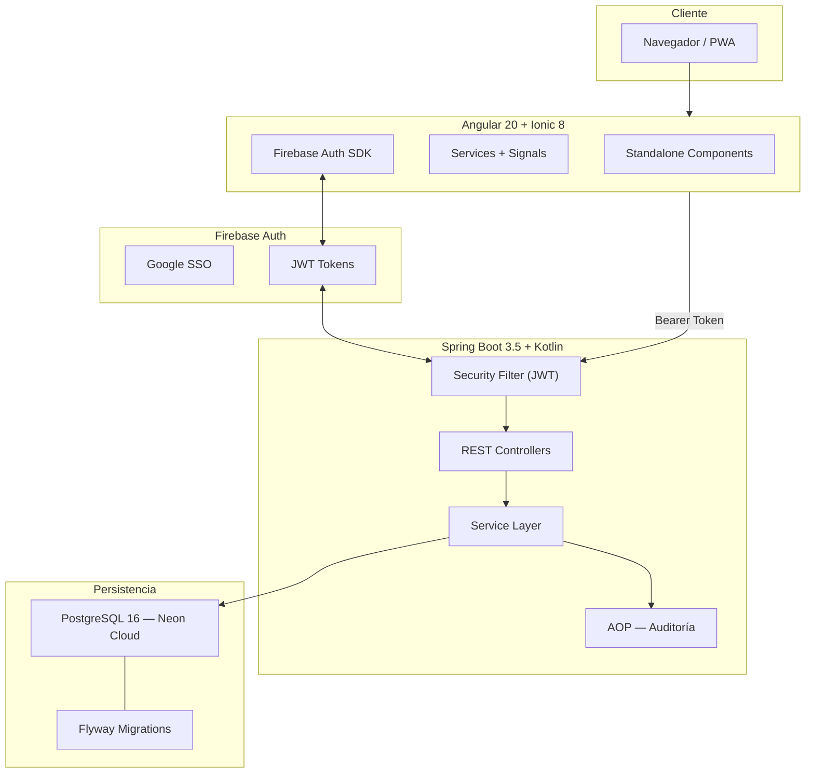
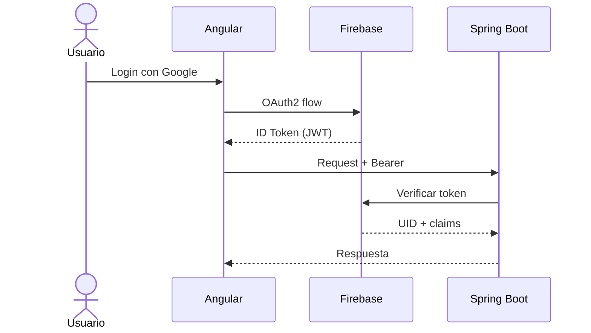
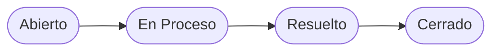

<div class="absolute inset-0 bg-gradient-to-br from-slate-950 via-slate-900 to-blue-950" />

<div class="relative z-10 h-full flex flex-col items-center justify-center gap-5">

<div class="inline-flex items-center gap-2 px-4 py-1.5 rounded-full bg-blue-500/10 border border-blue-500/30 text-blue-400 text-xs tracking-widest uppercase font-semibold">
  TFG · DAM · IES Rafael Alberti · 2026
</div>

<h1 class="!text-8xl !font-black !tracking-tighter !text-white !leading-none mt-2">
  Dev<span class="text-blue-400">Nexus</span>
</h1>

<p class="text-xl text-slate-400 max-w-lg leading-relaxed mt-2">
  Plataforma colaborativa de gestión de diarios,<br>incidencias y comunicación para desarrolladores
</p>

<div class="flex items-center gap-4 mt-4 text-slate-500 text-sm">
  <div class="w-16 h-px bg-slate-700"/>
  <span>Jesús Alfonso Pedreño Domínguez</span>
  <div class="w-16 h-px bg-slate-700"/>
</div>

</div>

<div class="absolute bottom-8 left-1/2 -translate-x-1/2 text-slate-600 text-xs flex items-center gap-2 animate-pulse">
  <div class="i-carbon-arrow-right" />
  espacio para continuar
</div>

---
layout: default
---

# Índice

<div class="grid grid-cols-3 gap-4 mt-6">

<div v-click class="flex flex-col gap-1.5 p-5 rounded-xl bg-slate-800/50 border border-slate-700/50 text-left">
  <span class="text-blue-400 font-black text-2xl">01</span>
  <span class="font-semibold text-white text-sm">El Problema</span>
  <span class="text-xs text-slate-500">Fragmentación de herramientas</span>
</div>

<div v-click class="flex flex-col gap-1.5 p-5 rounded-xl bg-slate-800/50 border border-slate-700/50 text-left">
  <span class="text-blue-400 font-black text-2xl">02</span>
  <span class="font-semibold text-white text-sm">La Solución</span>
  <span class="text-xs text-slate-500">DevNexus — todo en uno</span>
</div>

<div v-click class="flex flex-col gap-1.5 p-5 rounded-xl bg-slate-800/50 border border-slate-700/50 text-left">
  <span class="text-blue-400 font-black text-2xl">03</span>
  <span class="font-semibold text-white text-sm">Arquitectura</span>
  <span class="text-xs text-slate-500">Stack tecnológico y capas</span>
</div>

<div v-click class="flex flex-col gap-1.5 p-5 rounded-xl bg-slate-800/50 border border-slate-700/50 text-left">
  <span class="text-violet-400 font-black text-2xl">04</span>
  <span class="font-semibold text-white text-sm">Módulos</span>
  <span class="text-xs text-slate-500">Diarios, Tickets, Mensajería</span>
</div>

<div v-click class="flex flex-col gap-1.5 p-5 rounded-xl bg-slate-800/50 border border-slate-700/50 text-left">
  <span class="text-violet-400 font-black text-2xl">05</span>
  <span class="font-semibold text-white text-sm">Seguridad y DevOps</span>
  <span class="text-xs text-slate-500">Firebase, Docker, Neon</span>
</div>

<div v-click class="flex flex-col gap-1.5 p-5 rounded-xl bg-slate-800/50 border border-slate-700/50 text-left">
  <span class="text-violet-400 font-black text-2xl">06</span>
  <span class="font-semibold text-white text-sm">Conclusiones</span>
  <span class="text-xs text-slate-500">Logros y mejoras futuras</span>
</div>

</div>

---
layout: center
---

# El Problema

<div class="grid grid-cols-3 gap-5 mt-8 text-left">

<div v-click class="p-5 rounded-xl bg-red-950/30 border border-red-800/40">
  <div class="i-carbon-warning-alt text-red-400 text-3xl mb-3" />
  <div class="font-semibold text-red-300 mb-2">Dispersión de herramientas</div>
  <div class="text-sm text-slate-400">Jira, Slack, Notion, GitHub... el equipo vive saltando entre pestañas</div>
</div>

<div v-click class="p-5 rounded-xl bg-orange-950/30 border border-orange-800/40">
  <div class="i-carbon-data-error text-orange-400 text-3xl mb-3" />
  <div class="font-semibold text-orange-300 mb-2">Sin trazabilidad diaria</div>
  <div class="text-sm text-slate-400">El progreso real queda fuera de los sistemas formales de gestión</div>
</div>

<div v-click class="p-5 rounded-xl bg-yellow-950/30 border border-yellow-800/40">
  <div class="i-carbon-disconnect text-yellow-400 text-3xl mb-3" />
  <div class="font-semibold text-yellow-300 mb-2">Comunicación rota</div>
  <div class="text-sm text-slate-400">El contexto de las incidencias se pierde en hilos de chat dispersos</div>
</div>

</div>

<div v-click class="mt-8 inline-flex items-center gap-3 px-6 py-3 rounded-full bg-slate-800 border border-slate-600 text-slate-300">
  <div class="i-carbon-arrow-right text-blue-400 flex-shrink-0" />
  ¿Y si todo estuviera en <strong class="text-white ml-1">una sola plataforma</strong>?
</div>

---
layout: center
---

# Arquitectura del Sistema



---

# Stack Tecnológico

<div class="grid grid-cols-2 gap-6 mt-5">

<div class="rounded-xl border border-blue-500/30 bg-blue-950/20 p-5 text-left">
  <div class="flex items-center gap-2 mb-4">
    <div class="i-carbon-bare-metal-server text-blue-400 text-xl" />
    <h3 class="!text-blue-400 !text-base !my-0 font-bold uppercase tracking-wider">Backend</h3>
  </div>
  <div class="space-y-3">
    <div class="flex justify-between items-center text-sm">
      <code>Spring Boot 3.5</code>
      <span class="text-slate-500">Framework principal</span>
    </div>
    <div class="flex justify-between items-center text-sm">
      <code>Kotlin 2.0</code>
      <span class="text-slate-500">Null-safety · conciso</span>
    </div>
    <div class="flex justify-between items-center text-sm">
      <code>PostgreSQL 16</code>
      <span class="text-slate-500">Persistencia relacional</span>
    </div>
    <div class="flex justify-between items-center text-sm">
      <code>Flyway</code>
      <span class="text-slate-500">Migraciones versionadas</span>
    </div>
    <div class="flex justify-between items-center text-sm">
      <code>Firebase Admin</code>
      <span class="text-slate-500">Auth delegada</span>
    </div>
  </div>
</div>

<div class="rounded-xl border border-violet-500/30 bg-violet-950/20 p-5 text-left">
  <div class="flex items-center gap-2 mb-4">
    <div class="i-carbon-application text-violet-400 text-xl" />
    <h3 class="!text-violet-400 !text-base !my-0 font-bold uppercase tracking-wider">Frontend</h3>
  </div>
  <div class="space-y-3">
    <div class="flex justify-between items-center text-sm">
      <code>Angular 20</code>
      <span class="text-slate-500">Signals · Standalone</span>
    </div>
    <div class="flex justify-between items-center text-sm">
      <code>Ionic 8</code>
      <span class="text-slate-500">UI multiplataforma</span>
    </div>
    <div class="flex justify-between items-center text-sm">
      <code>Firebase Auth</code>
      <span class="text-slate-500">Google SSO</span>
    </div>
    <div class="flex justify-between items-center text-sm">
      <code>FCM</code>
      <span class="text-slate-500">Push notifications</span>
    </div>
    <div class="flex justify-between items-center text-sm">
      <code>PWA</code>
      <span class="text-slate-500">Offline-ready</span>
    </div>
  </div>
</div>

</div>

---

# Seguridad — Firebase + JWT

<div class="grid grid-cols-2 gap-6 mt-4">

<div>



</div>

<div class="space-y-4 text-sm text-left">

<div v-click class="p-4 rounded-lg bg-slate-800/60 border border-slate-700/50">
  <div class="text-blue-400 font-semibold mb-1 flex items-center gap-2">
    <div class="i-carbon-security" /> Firebase SDK
  </div>
  <div class="text-slate-400 text-xs">El backend verifica cada token contra Firebase. Sin gestión de contraseñas.</div>
</div>

<div v-click class="p-4 rounded-lg bg-slate-800/60 border border-slate-700/50">
  <div class="text-violet-400 font-semibold mb-1 flex items-center gap-2">
    <div class="i-carbon-filter" /> Spring Filter
  </div>
  <div class="text-slate-400 text-xs">Cada request es autenticado antes de llegar al controller. Zero-trust.</div>
</div>

<div v-click class="p-4 rounded-lg bg-slate-800/60 border border-slate-700/50">
  <div class="text-green-400 font-semibold mb-1 flex items-center gap-2">
    <div class="i-carbon-report" /> AOP — Auditoría
  </div>
  <div class="text-slate-400 text-xs">Aspect que registra automáticamente quién hizo qué y cuándo. Trazabilidad.</div>
</div>

</div>

</div>

---
layout: two-cols
---

# Diarios de Progreso

<div class="pr-6 mt-2 text-left">

Registro diario del trabajo con **flujo de revisión**.

<div class="mt-5 space-y-3">

<div v-click class="flex items-center gap-3 px-4 py-3 rounded-lg bg-slate-800/40 border border-slate-700/40 text-sm">
  <div class="w-2.5 h-2.5 rounded-full bg-slate-500" />
  <div><strong class="text-slate-300">PRIVADO</strong></div>
</div>

<div v-click class="flex items-center gap-3 px-4 py-3 rounded-lg bg-amber-950/40 border border-amber-800/40 text-sm">
  <div class="w-2.5 h-2.5 rounded-full bg-amber-400" />
  <div><strong class="text-amber-300">REVISIÓN</strong></div>
</div>

<div v-click class="flex items-center gap-3 px-4 py-3 rounded-lg bg-green-950/40 border border-green-800/40 text-sm">
  <div class="w-2.5 h-2.5 rounded-full bg-green-400" />
  <div><strong class="text-green-300">PÚBLICO</strong></div>
</div>

</div>

</div>

::right::

```kotlin
@Entity
class Diario(
    @Id @GeneratedValue
    val id: Long? = null,
    val titulo: String,
    val contenido: String,
    var estado: EstadoDiario = PRIVADO,
    @ManyToOne(fetch = LAZY)
    val autor: Usuario
)
```

---

# Módulo: Tickets e Incidencias

<div class="grid grid-cols-2 gap-10 mt-4">

<div class="text-left">
  <h3 class="text-slate-400 text-xs uppercase tracking-wider font-semibold mb-3">Categorías</h3>
  <div class="space-y-2">
    <div v-click class="flex items-center gap-3 px-4 py-2 bg-red-950/30 border border-red-800/40 rounded-lg text-sm">
      <span class="w-2 h-2 rounded-full bg-red-500" />
      <strong class="text-red-300">BUG</strong>
    </div>
    <div v-click class="flex items-center gap-3 px-4 py-2 bg-blue-950/30 border border-blue-800/40 rounded-lg text-sm">
      <span class="w-2 h-2 rounded-full bg-blue-500" />
      <strong class="text-blue-300">FEATURE</strong>
    </div>
    <div v-click class="flex items-center gap-3 px-4 py-2 bg-violet-950/30 border border-violet-800/40 rounded-lg text-sm">
      <span class="w-2 h-2 rounded-full bg-violet-500" />
      <strong class="text-violet-300">MEJORA</strong>
    </div>
  </div>
</div>

<div class="text-left">
  <h3 class="text-slate-400 text-xs uppercase tracking-wider font-semibold mb-3">Workflow</h3>



</div>

</div>

---

# Despliegue — Docker + Neon Cloud

<div class="grid grid-cols-2 gap-6 mt-4">

<div>

```yaml
# docker-compose.yml
services:
  backend:
    build: ./Back
    ports: ["8080:8080"]
    environment:
      DB_URL: ${NEON_DB_URL}
  frontend:
    build: ./Front
    ports: ["80:80"]
```

</div>

<div class="space-y-4 text-sm text-left">

<div v-click class="p-4 rounded-xl bg-slate-800/60 border border-slate-700/50">
  <div class="flex items-center gap-2 mb-1">
    <div class="i-carbon-container-software text-blue-400" />
    <span class="font-semibold text-white">Docker + Compose</span>
  </div>
  <p class="text-slate-400 text-xs">Un solo comando levanta todo el sistema.</p>
</div>

<div v-click class="p-4 rounded-xl bg-slate-800/60 border border-slate-700/50">
  <div class="flex items-center gap-2 mb-1">
    <div class="i-carbon-cloud text-green-400" />
    <span class="font-semibold text-white">Neon Cloud</span>
  </div>
  <p class="text-slate-400 text-xs">PostgreSQL serverless con Flyway.</p>
</div>

<div v-click class="p-4 rounded-xl bg-slate-800/60 border border-slate-700/50">
  <div class="flex items-center gap-2 mb-1">
    <div class="i-carbon-activity text-violet-400" />
    <span class="font-semibold text-white">Spring Actuator</span>
  </div>
  <p class="text-slate-400 text-xs">Health checks para monitoreo.</p>
</div>

</div>

</div>

---
layout: center
---

# Resultados

<div class="grid grid-cols-4 gap-4 mt-8 max-w-3xl mx-auto">

<div v-click class="p-5 rounded-xl bg-slate-800/60 border border-slate-700/50">
  <div class="text-5xl font-black text-blue-400">5</div>
  <div class="text-xs text-slate-400 mt-2">herramientas<br>unificadas</div>
</div>

<div v-click class="p-5 rounded-xl bg-slate-800/60 border border-slate-700/50">
  <div class="text-5xl font-black text-violet-400">3</div>
  <div class="text-xs text-slate-400 mt-2">módulos<br>principales</div>
</div>

<div v-click class="p-5 rounded-xl bg-slate-800/60 border border-slate-700/50">
  <div class="text-4xl font-black text-green-400">AOP</div>
  <div class="text-xs text-slate-400 mt-2">auditoría<br>automática</div>
</div>

<div v-click class="p-5 rounded-xl bg-slate-800/60 border border-slate-700/50">
  <div class="text-4xl font-black text-amber-400">PWA</div>
  <div class="text-xs text-slate-400 mt-2">web y móvil</div>
</div>

</div>

<div class="mt-8 text-left max-w-2xl mx-auto space-y-3">

<div v-click class="flex items-center gap-3 text-sm text-slate-300">
  <div class="i-carbon-checkmark-filled text-green-400" />
  Arquitectura profesional — Spring Boot + Kotlin + Angular
</div>

<div v-click class="flex items-center gap-3 text-sm text-slate-300">
  <div class="i-carbon-checkmark-filled text-green-400" />
  Seguridad enterprise — Firebase Auth + JWT
</div>

</div>

---
layout: center
---

# Conclusiones y Futuro

<div class="grid grid-cols-2 gap-10 mt-6 text-left max-w-3xl mx-auto">

<div>
  <h3 class="text-slate-400 text-xs uppercase font-semibold mb-4">Logros</h3>
  <div class="space-y-3 text-sm">
    <div v-click class="flex items-start gap-2">
      <div class="i-carbon-checkmark text-green-400 mt-0.5" />
      <span>Plataforma funcional completa</span>
    </div>
    <div v-click class="flex items-start gap-2">
      <div class="i-carbon-checkmark text-green-400 mt-0.5" />
      <span>Arquitectura en capas SOLID</span>
    </div>
  </div>
</div>

<div>
  <h3 class="text-slate-400 text-xs uppercase font-semibold mb-4">Futuro</h3>
  <div class="space-y-3 text-sm">
    <div v-click class="flex items-start gap-2">
      <div class="i-carbon-arrow-right text-blue-400 mt-0.5" />
      <span>Integración GitHub API</span>
    </div>
    <div v-click class="flex items-start gap-2">
      <div class="i-carbon-arrow-right text-blue-400 mt-0.5" />
      <span>Modo offline PWA</span>
    </div>
  </div>
</div>

</div>

---
layout: center
---

<h1 class="!text-6xl !font-black !text-white">¿Preguntas?</h1>
<p class="text-slate-400 text-lg mt-4">Gracias por su atención</p>

<div class="flex items-center gap-4 text-sm text-slate-500 mt-8">
  <span>Jesús Alfonso Pedreño Domínguez</span>
  <span>·</span>
  <span>Junio 2026</span>
</div>
